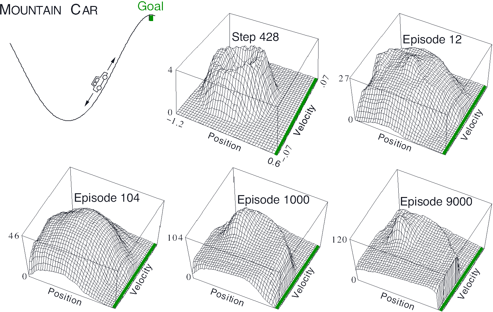

title: NPFL139, Lecture 4
class: title, langtech, cc-by-sa
# Function Approximation, Deep Q Network, Rainbow

## Milan Straka

### March 10, 2026

---
section: FunApprox
class: section

# Function Approximation

<i>Applause please: neural networks arrive at the scene.</i>

---
# Function Approximation

We now approximate the value function $v$ and/or the action-value function $q$,
selecting it from a family of functions parametrized by a weight vector $→w ∈ ℝ^d$.

~~~
We denote the approximations as
$$\begin{gathered}
  v̂(s; →w),\\
  q̂(s, a; →w).
\end{gathered}$$

~~~
Weights are usually shared among states. Therefore, we need to define state
distribution $μ(s)$ to obtain an objective for finding the best function approximation
(if we give preference to some states, improving their estimates might worsen
estimates in other states).

~~~
The state distribution $μ(s)$ gives rise to a natural objective function called
**Mean Squared Value Error**, denoted $\overline{VE}$:
$$\overline{VE}(→w) ≝ ∑_{s∈𝓢} μ(s) \big(v_π(s) - v̂(s; →w)\big)^2.$$

---
# Function Approximation

For on-policy algorithms, $μ(s)$ is most commonly the on-policy distribution (fraction of
time spent in state $s$ when following policy $π$).

~~~
- For **episodic tasks**, let $h(s)$ be the probability that an episodes starts in state $s$,
  and let $η(s)$ denote the number of time steps spent, on average, in state $s$
  in a single episode:
  $$η(s) = h(s) + ∑\nolimits_{s'}η(s')∑\nolimits_a π(a|s') p(s|s', a).$$

~~~
  The on-policy distribution is then obtained by normalizing: $μ(s) ≝ \frac{η(s)}{∑_{s'} η(s')}.$

~~~
  

  If there is discounting ($γ<1$), it should be treated as a form of
  termination, by including a factor $γ$ to the second term of the $η(s)$ equation.

~~~
- For **continuing tasks**, we require $γ<1$, and employ the same definition as
  in the episodic case.

---
# Gradient and Semi-Gradient Methods

The function approximation (i.e., the weight vector $→w$) is usually optimized
using gradient methods, for example as
$$\begin{aligned}
  →w_{t+1} &← →w_t - \tfrac{1}{2} α ∇_{→w_t} \big(v_π(S_t) - v̂(S_t; →w_t)\big)^2\\
           &← →w_t + α\big(v_π(S_t) - v̂(S_t; →w_t)\big) ∇_{→w_t} v̂(S_t; →w_t).\\
\end{aligned}$$

~~~
As usual, the $v_π(S_t)$ is estimated by a suitable sample of a return:
~~~
- in Monte Carlo methods, we use episodic return $G_t$,
~~~
- in temporal difference methods, we employ bootstrapping and use
  one-step return
  $$R_{t+1} + [¬\textrm{done}]⋅γv̂(S_{t+1}; →w)$$
  or an $n$-step return.

---
class: middle
# Monte Carlo Gradient Policy Evaluation

If the return estimate $G_t$ is unbiased (which it is in a Monte Carlo method),
the policy evaluation algorithm is guaranteed to converge to a local optimum of
the mean squared value error under the usual SGD conditions.

---
# Linear Methods

A simple special case of function approximation are linear methods, where
$$v̂\big(→x(s); →w\big) ≝ →x(s)^\T →w = ∑x(s)_i w_i.$$

~~~
The $→x(s)$ is a representation of state $s$, which is a vector of the same size
as $→w$. It is sometimes called a _feature vector_.

~~~
The SGD update rule then becomes
$$→w_{t+1} ← →w_t + α\big(v_π(S_t) - v̂(→x(S_t); →w_t)\big) →x(S_t).$$

~~~
This rule is the same as in the tabular methods if $→x(s)$ is the one-hot
representation of the state $s$.

---
# State Aggregation

Simple way of generating a feature vector is **state aggregation**, where several
neighboring states are grouped together.

~~~
For example, consider a 1000-state random walk, where transitions lead uniformly
randomly to any of 100 neighboring states on the left or on the right. Using
state aggregation, we can partition the 1000 states into 10 groups of 100
states. Monte Carlo policy evaluation then computes the following:

---
# Feature Construction for Linear Methods

Many methods for constructing features for linear methods have been developed in the past:
~~~
- polynomials,

~~~
- Fourier bases,
~~~
- radial basis functions,
~~~
- tile coding,
~~~
- …

~~~
But of course, nowadays we use deep neural networks, which construct a suitable
feature vector automatically as a latent variable (the last hidden layer).

---
section: TileCoding
class: section
# Tile Coding

---
# Tile Coding

Tile conding can be considered a generalization of state aggregation.

~~~
If $t$ overlapping tiles are used, the learning rate is usually normalized as $α/t$.

---
# Tile Coding

For example, on the 1000-state random walk example, the performance of the tile
coding surpasses state aggregation:

Each tile covers 200 states, and when multiple tiles are used, they are offset
by 4 states.

---
# Asymmetrical Tile Coding

In higher dimensions, the tiles should have asymmetrical offsets, with
a sequence of $(1, 3, 5, …, 2d-1)$ proposed as a good choice.

---
section: SemiGradient
class: section
# Gradient and Semi-Gradient Methods

---
# Temporal Difference Semi-Gradient Policy Evaluation

In TD methods, we again bootstrap the estimate $v_π(S_t)$ as
$R_{t+1} + [¬\textrm{done}]⋅γv̂(S_{t+1}; →w)$.

~~~

---
style: .katex-display { margin: .7em 0 }
# Why Semi-Gradient TD

Note that the above algorithm is called **semi-gradient** because it does not
backpropagate through $v̂(S_{t+1}; →w)$:
$$→w ← →w + α\big(R_{t+1} + [¬\textrm{done}]⋅γv̂(S_{t+1}; →w) - v̂(S_t; →w)\big) ∇_{→w} v̂(S_t; →w).$$

~~~
In fact, the above rule is not an SGD update, because there does not exist
a sufficiently continuous function $J(→w)$, for which we would get the above
update.

~~~
To sketch a proof, consider a linear $v̂(S_t; →w) = ∑_i x(S_t)_i w_i$ and assume such a $J(→w)$ exists.
Then
$$\tfrac{∂}{∂w_i}J(→w) = \big(R_{t+1} + γv̂(S_{t+1}; →w) - v̂(S_t; →w)\big) x(S_t)_i.$$

~~~
We now verify that the second derivatives are not equal, which is
a contradiction with the Schwarz's theorem (stating that partial derivatives
commute as long as they are differentiable):
$$\begin{aligned}
  \tfrac{∂}{∂w_i}\tfrac{∂}{∂w_j}J(→w) &= \big(γx(S_{t+1})_i - x(S_t)_i\big) x(S_t)_j = γx(S_{t+1})_{\textcolor{red}{i}} x(S_t)_{\textcolor{red}{j}} - x(S_t)_i x(S_t)_j \\
  \tfrac{∂}{∂w_j}\tfrac{∂}{∂w_i}J(→w) &= \big(γx(S_{t+1})_j - x(S_t)_j\big) x(S_t)_i = γx(S_{t+1})_{\textcolor{red}{j}} x(S_t)_{\textcolor{red}{i}} - x(S_t)_i x(S_t)_j
\end{aligned}$$

---
# Gradient and Semi-Gradient Methods

Note that “fixing” the algorithm by allowing to backpropagate through the
bootstrap estimate $R_{t+1} + v̂(S_{t+1}; →w)$ would not work at all. If
we consider such an update

$$\begin{aligned}
  →w_{t+1} &← →w_t - \tfrac{1}{2} α ∇_{→w_t} \big(R_{t+1} + v̂(S_{t+1}; →w) - v̂(S_t; →w_t)\big)^2\\
           &← →w_t + α\big(R_{t+1} + v̂(S_{t+1}; →w) - v̂(S_t; →w_t)\big) ∇_{→w_t} \big(v̂(S_t; →w_t) \textcolor{red}{- v̂(S_{t+1}; →w)}\big),\\
\end{aligned}$$

~~~
then for a linear method $v̂\big(→x(s); →w\big) ≝ →x(s)^\T →w$ we would get

$$→w_{t+1} ← →w_t + α\big(R_{t+1} + v̂(S_{t+1}; →w) - v̂(S_t; →w_t)\big) \big(→x(S_t) \textcolor{red}{- →x(S_{t+1})}\big).$$

~~~
To consider a concrete case, assume the $x(S_t)$ are one-hot encoded, so the
update is in fact equal to a tabular method. Then we would update not only
the value estimate for state $S_t$, but also the value estimate for $S_{t+1}$ in
the opposite direction.

---
# Temporal Difference Semi-Gradient Convergence

It can be proven (by using a separate theory than for SGD) that the linear
semi-gradient TD methods do converge.

~~~
However, they do not converge to the optimum of $\overline{VE}$. Instead, they
converge to a different **TD fixed point** $→w_\mathrm{TD}$.

~~~
It can be proven that
$$\overline{VE}(→w_\mathrm{TD}) ≤ \frac{1}{1-γ} \min_{→w} \overline{VE}(→w).$$

~~~
However, when $γ$ is close to one, the multiplication factor in the above bound
is quite large.

---
# Temporal Difference Semi-Gradient Policy Evaluation

As before, we can utilize $n$-step TD methods.

---
# Temporal Difference Semi-Gradient Policy Evaluation

Recall the previous described 1000-state random walk, where transitions lead
uniformly randomly to any of 100 neighboring states on the left or on the right.
Using state aggregation, we can partition the 1000 states into 10 groups of 100
states. Monte Carlo policy evaluation result is on the right:

~~~
The results using one-step TD(0) are presented below (left); the effect of
increasing $n$ in an $n$-step variant is on the right.

---
# Sarsa with Function Approximation

Until now, we talked only about policy evaluation. Naturally, we can extend it
to a full Sarsa algorithm:

---
# Sarsa with Function Approximation

Additionally, we can incorporate $n$-step returns:

---
# Mountain Car Example via Sarsa

The performances are for semi-gradient Sarsa($λ$) algorithm (which we did not
talked about yet) with tile coding of 8 overlapping tiles covering position and
velocity, with offsets of $(1, 3)$.

---
# Mountain Car Example via Sarsa

---
section: OffPolicyDivergence
class: section
# Off-policy Divergence With Function Approximation

---
# Off-policy Divergence With Function Approximation

Consider a deterministic transition between two states whose values are computed
using the same weight:

~~~
- If initially $w=10$, the TD error will be also 10 (or nearly 10 if $γ<1$).
~~~
- If for example $α=0.1$, $w$ will be increased to 11 (by 10%).
~~~
- This process can continue indefinitely.

~~~
However, the problem arises only in off-policy setting, where we do not decrease
value of the second state from further observation.

---
# Off-policy Divergence With Function Approximation

The previous idea can be implemented for instance by the following **Baird's
counterexample**:

The rewards are zero everywhere, so the value function is also zero everywhere.
We assume the initial values of weights are 1, except for $w_7=10$, and that the
learning rate $α=0.01$.

---
# Off-policy Divergence With Function Approximation

For off-policy semi-gradient Sarsa, or even for off-policy
dynamic-programming update (where we compute expectation over all following
states and actions), the weights diverge to $+∞$.
Using on-policy distribution converges fine.

$$→w ← →w + \frac{α}{|𝓢|} ∑_s \Big(𝔼_π \big[R_{t+1} + γv̂(S_{t+1}; →w) | S_t=s\big] - v̂(s; →w)\Big) ∇v̂(s; →w)$$

---
# Off-policy Divergence With Function Approximation

The divergence can happen when all following elements are combined:

- function approximation;

~~~
- bootstrapping;

~~~
- off-policy training.

In the Sutton's and Barto's book, these are called **the deadly triad**.

---
section: DQN
class: section
# Deep Q Networks

---
# Deep Q Networks

Volodymyr Mnih et al.: _Playing Atari with Deep Reinforcement Learning_ (Dec 2013 on arXiv),

~~~
in Feb 2015 accepted in Nature as _Human-level control through deep reinforcement learning_.

~~~
Off-policy Q-learning algorithm with a convolutional neural network function
approximation of action-value function.

~~~
Training can be brittle and can diverge easily (assumedly for the same reasons
as why the Baird's counterexample diverges).

---
# Deep Q Network

---
# Deep Q Networks

- Preprocessing: $210×160$ 128-color images are converted to grayscale and
  then resized to $84×84$.

~~~
- **Frame skipping** technique is used, i.e., only every $4^\textrm{th}$ frame
  (out of 60 per second) is considered, and the selected action is repeated on
  the other frames.
~~~
- **Frame stacking** is utilized—the input to the network are the last $4$
  frames (considering only the frames kept by frame skipping), i.e., the network
  inputs is an image with $4$ channels.
~~~
- The network is fairly standard, performing
  - 32 filters of size $8×8$ with stride 4, padding 1, and ReLU,$\textcolor{gray}{→ 20×20×32}$
  - 64 filters of size $4×4$ with stride 2, padding 0, and ReLU,$\textcolor{gray}{→ 9×9×64}$
  - 64 filters of size $3×3$ with stride 1, padding 0, and ReLU,$\textcolor{gray}{→ 7×7×64}$
  - fully connected layer with 512 units and ReLU,$\textcolor{gray}{→ 512}$
  - output layer with 18 output units (one for each action)
~~~

  Such a network has approximately 1.7M parameters (1.6M of them in the FC layer).

---
# Deep Q Networks

- Network is trained with RMSProp to minimize the following loss:
  $$𝓛 ≝ 𝔼_{(s, a, r, s')∼\mathrm{data}}\left[(r + \left[¬\textrm{done}\right] ⋅ γ \max\nolimits_{a'} Q(s', a'; →θ̄) - Q(s, a; →θ))^2\right].$$
~~~
- An $ε$-greedy behavior policy is utilized (starts at $ε=1$ and gradually decreases to $0.1$).

~~~
Important improvements:
~~~
- **experience replay**: the generated episodes are stored in a buffer as $(s, a, r,
  s')$ quadruples, and for training a transition is sampled uniformly
  (off-policy training);
~~~
- separate **target network** $→θ̄$: to prevent instabilities, a separate _target
  network_ is used to estimate one-step returns. The weights are not trained,
  but copied from the trained network after a fixed number of gradient updates;
~~~
- reward clipping: because rewards have wildly different scale in different
  games, all positive rewards are replaced by $+1$ and negative by $-1$;
  life loss is used as an end of episode.
~~~
  - furthermore, $(r + \left[¬\textrm{done}\right] ⋅ γ \max_{a'} Q(s', a'; →θ̄) - Q(s, a; →θ))$ is
    also clipped to $[-1, 1]$ (i.e., a $\textrm{smooth}_{L_1}$ loss or Huber loss).

---
# Deep Q Networks

---
# Deep Q Network

---
# Deep Q Network

---
# Deep Q Network

---
class: tablewide
style: td:nth-of-type(1) {width: 65%}
# Deep Q Networks Hyperparameters

| Hyperparameter | Value |
|----------------|-------|
| minibatch size | 32 |
~~~
| replay buffer size | 1M |
~~~
| target network update frequency | 10k |
~~~
| discount factor | 0.99 |
~~~
| training frames | 50M (200M game interactions) |
~~~
| RMSProp learning rate and both momentums | 0.00025, 0.95 |
~~~
| initial $ε$, final $ε$ (linear decay) and frame of final $ε$ | 1.0, 0.1, 1M |
~~~
| replay start size | 50k |
~~~
| no-op max | 30 |

---
section: Rainbow
class: section
# Rainbow

---
# Rainbow

There have been many suggested improvements to the DQN architecture. In the end
of 2017, the _Rainbow: Combining Improvements in Deep Reinforcement Learning_
paper combines 6 of them into a single architecture they call **Rainbow**.

~~~

---
section: DDQN
class: section
# Double Deep Q-Network

---
# Q-learning and Maximization Bias

Because behavior policy in Q-learning is $ε$-greedy variant of the target
policy, the same samples (up to $ε$-greedy) determine both the maximizing action
and estimate its value.

~~~

---
# Double Q-learning

---
style: .katex-display { margin: .5em 0 }
# Rainbow DQN Extensions

## Double Deep Q-Network

Similarly to double Q-learning, instead of
$$r + γ \max_{a'} Q(s', a'; →θ̄) - Q(s, a; →θ),$$
we minimize
$$r + γ Q(s', \argmax_{a'}Q(s', a'; →θ); →θ̄) - Q(s, a; →θ).$$

~~~

---
# Rainbow DQN Extensions

## Double Deep Q-Network

---
# Rainbow DQN Extensions

## Double Q-learning

---
# Rainbow DQN Extensions

## Double Q-learning

Performance on episodes taking at most 5 minutes and no-op starts on 49 games:

~~~
Performance on episodes taking at most 30 minutes and using 100 human starts on
each of the 49 games:

~~~
The Double DQN follows the training protocol of DQN; the tuned version increases
the target network update from 10k to 30k steps, decreases exploration during
training from $ε=0.1$ to $ε=0.01$, and uses a shared bias for all action values
in the output layer of the network.

---
section: PrioReplay
class: section
# Prioritized Replay

---
# Rainbow DQN Extensions

## Prioritized Replay

Instead of sampling the transitions uniformly from the replay buffer,
we instead prefer those with a large TD error. Therefore, we sample transitions
according to their probability
$$p_t ∝ \Big|r + γ \max_{a'} Q(s', a'; →θ̄) - Q(s, a; →θ)\Big|^ω,$$
~~~
where $ω$ controls the shape of the distribution (which is uniform for $ω=0$
and corresponds to TD error for $ω=1$).

~~~
New transitions are inserted into the replay buffer with maximum probability
to support exploration of all encountered transitions.

~~~
When combined with DDQN, the probabilities are naturally computed as
$$p_t ∝ \Big|r + γ Q(s', \argmax_{a'}Q(s', a'; →θ); →θ̄) - Q(s, a; →θ)\Big|^ω,$$

---
# Rainbow DQN Extensions

## Prioritized Replay

Because we now sample transitions according to $p_t$ instead of uniformly,
on-policy distribution and sampling distribution differ. To compensate, we
utilize importance sampling with ratio
$$ρ_t = \left( \frac{1/N}{p_t} \right) ^β.$$

~~~
Because the importance sampling ratios $ρ$ can be quite large, the authors
normalize them, as they say “for stability reasons”, in every batch:
$$ρ_t / \max_{t'∈\textit{batch}} ρ_{t'}.$$

~~~
Therefore, the largest normalized importance sampling ratio in every batch is 1.
The fact that normalization should happen in every batch is not explicitly
stated in the paper, and implementations normalizing over the whole replay
buffer also exist; but the DeepMind reference implementation does normalize
batch-wise.

---
# Rainbow DQN Extensions

## Prioritized Replay

