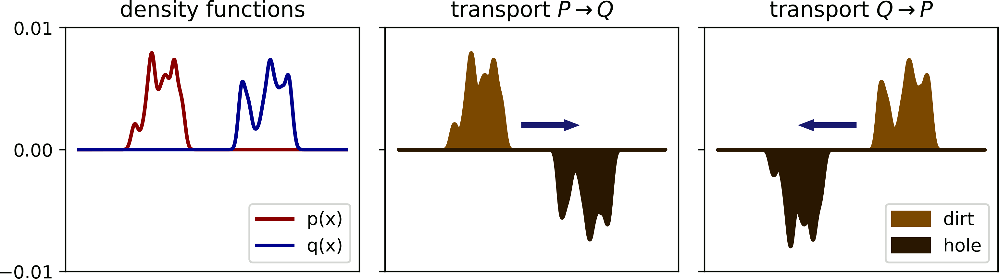
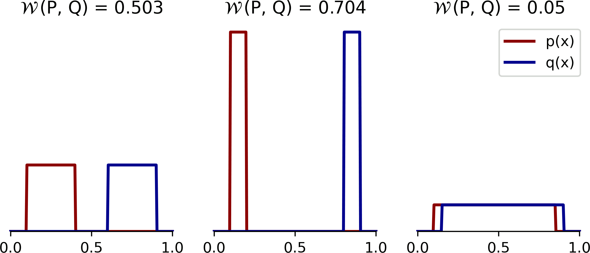

title: NPFL139, Lecture 5
class: title, langtech, cc-by-sa
# Rainbow II, Distributional RL

## Milan Straka

### March 19, 2025

---
class: section
# Refresh

---
# Rainbow

There have been many suggested improvements to the DQN architecture. In the end
of 2017, the _Rainbow: Combining Improvements in Deep Reinforcement Learning_
paper combines 6 of them into a single architecture they call **Rainbow**.

---
class: section
# Double Deep Q-Network

---
style: .katex-display { margin: .5em 0 }
# Rainbow DQN Extensions

## Double Deep Q-Network

Similarly to double Q-learning, instead of
$$r + γ \max_{a'} Q(s', a'; →θ̄) - Q(s, a; →θ),$$
we minimize
$$r + γ Q(s', \argmax_{a'}Q(s', a'; →θ); →θ̄) - Q(s, a; →θ).$$

---
# Rainbow DQN Extensions

## Double Q-learning

Performance on episodes taking at most 5 minutes and no-op starts on 49 games:

Performance on episodes taking at most 30 minutes and using 100 human starts on
each of the 49 games:

The Double DQN follows the training protocol of DQN; the tuned version increases
the target network update from 10k to 30k steps, decreases exploration during
training from $ε=0.1$ to $ε=0.01$, and uses a shared bias for all action values
in the output layer of the network.

---
class: section
# Prioritized Replay

---
# Rainbow DQN Extensions

## Prioritized Replay

Instead of sampling the transitions uniformly from the replay buffer,
we instead prefer those with a large TD error. Therefore, we sample transitions
according to their probability
$$p_t ∝ \Big|r + γ \max_{a'} Q(s', a'; →θ̄) - Q(s, a; →θ)\Big|^ω,$$
where $ω$ controls the shape of the distribution (which is uniform for $ω=0$
and corresponds to TD error for $ω=1$).

New transitions are inserted into the replay buffer with maximum probability
to support exploration of all encountered transitions.

When combined with DDQN, the probabilities are naturally computed as
$$p_t ∝ \Big|r + γ Q(s', \argmax_{a'}Q(s', a'; →θ); →θ̄) - Q(s, a; →θ)\Big|^ω,$$

---
# Rainbow DQN Extensions

## Prioritized Replay

Because we now sample transitions according to $p_t$ instead of uniformly,
on-policy distribution and sampling distribution differ. To compensate, we
utilize importance sampling with ratio
$$ρ_t = \left( \frac{1/N}{p_t} \right) ^β.$$

Because the importance sampling ratios $ρ$ can be quite large, the authors
normalize them, as they say “for stability reasons”, in every batch:
$$ρ_t / \max_{t'∈\textit{batch}} ρ_{t'}.$$

Therefore, the largest normalized importance sampling ratio in every batch is 1.
The fact that normalization should happen in every batch is not explicitly
stated in the paper, and implementations normalizing over the whole replay
buffer also exist; but the DeepMind reference implementation does normalize
batch-wise.

---
# Rainbow DQN Extensions

## Prioritized Replay

---
class: section
# Dueling Networks

---
# Rainbow DQN Extensions

## Dueling Networks

Instead of computing directly $Q(s, a; →θ)$, we compose it from the following quantities:
- average return in a given state $s$, $V(s; →θ) = \frac{1}{|𝓐|} ∑_a Q(s, a; →θ)$,
- advantage function computing an **advantage** $Q(s, a; →θ) - V(s; θ)$ of action $a$ in state $s$.

$$Q(s, a) ≝ V\big(f(s; ζ); η\big) + A\big(f(s; ζ), a; ψ\big) - \frac{\sum_{a' ∈ 𝓐} A(f(s; ζ), a'; ψ)}{|𝓐|}$$

---
# Rainbow DQN Extensions

## Dueling Networks

Evaluation is performed using $ε$-greedy exploration with $ε=0.001$;
in the experiment, the horizontal corridor has a length of 50 steps, while the
vertical sections have both 10 steps.

---
# Rainbow DQN Extensions

## Dueling Networks

---
# Rainbow DQN Extensions

## Dueling Networks

Results on all 57 games (retraining the original DQN on the 8 missing games).
`Single` refers to DDQN with a direct computation of $Q(s, a; →θ)$, `Single Clip`
corresponds to additional gradient clipping to norm at most 10 and larger
first hidden layer (so that duelling and single have roughly the same
number of parameters).

---
section: $N$-step
class: section
# Multi-step DQN

---
# Rainbow DQN Extensions
## Multi-step DQN

Instead of Q-learning, we use $n$-step variant of Q-learning, which estimates
return as
$$∑_{i=1}^n γ^{i-1} R_i + γ^n \max_{a'} Q(s', a'; →θ̄).$$

~~~
This changes the off-policy algorithm to on-policy (because the “inner” actions
are sampled from the behaviour distribution, but should follow the target distribution);
however, it is not discussed in any way by the authors.

---
section: NoisyNets
class: section
# Noisy Nets

---
# Rainbow DQN Extensions

## Noisy Nets

Noisy Nets are neural networks whose weights and biases are perturbed by
a parametric function of a noise.

~~~
The parameters $→θ$ of a regular neural network are in Noisy nets represented as
$$→θ ≈ →μ + →σ ⊙ →ε,$$
where $→ε$ is zero-mean noise with fixed statistics. We therefore learn the
parameters $(→μ, →σ)$.

~~~
A fully connected layer $→y = →w →x + →b$ with parameters $(→w, →b)$ is
represented in the following way in Noisy nets:
$$→y = (→μ_w + →σ_w ⊙ →ε_w) →x + (→μ_b + →σ_b ⊙ →ε_b).$$

~~~
Each $σ_{i,j}$ is initialized to $\frac{σ_0}{\sqrt{n}}$, where $n$ is the number
of input neurons of the layer in question, and $σ_0$ is a hyperparameter; commonly 0.5.

---
# Rainbow DQN Extensions

## Noisy Nets

The noise $ε$ can be for example independent Gaussian noise. However, for
performance reasons, factorized Gaussian noise is used to generate a matrix of
noise. If $ε_{i, j}$ is noise corresponding to a layer with $n$ inputs and $m$
outputs, we generate independent noise $ε_i$ for input neurons, independent
noise $ε_j$ for output neurons, and set
$$ε_{i,j} = f(ε_i) f(ε_j)~~~\textrm{for}~~~f(x) = \operatorname{sign}(x) \sqrt{|x|}.$$
~~~
The authors generate noise samples for every batch, sharing the noise for all
batch instances (consequently, during loss computation, online and target
network use independent noise).

~~~
### Deep Q Networks
When training a DQN, $ε$-greedy is no longer used (all policies are greedy), and
all fully connected layers are parametrized as noisy nets in both the current
and target network (i.e., networks produce samples from the distribution of
returns, and greedy actions still explore).

---
# Rainbow DQN Extensions

## Noisy Nets

---
# Rainbow DQN Extensions

## Noisy Nets

The $Σ̄$ is the mean-absolute of the noise weights $→σ_w$, i.e.,
$Σ̄ = \frac{1}{\textit{layer size}} \|→σ_w\|_1$.

---
section: DistributionalRL
class: section
# Distributional RL

---
# Rainbow DQN Extensions

## Distributional RL

Instead of an expected return $Q(s, a)$, we could estimate the distribution of
expected returns $Z(s, a)$ – the _value distribution_.

~~~
The authors define the distributional Bellman operator $𝓣^π$ as:
$$𝓣^π Z(s, a) ≝ R(s, a) + γ Z(S', A')~~~\textrm{for}~~~S'∼p(s, a), A'∼π(S').$$

~~~
The authors of the paper prove similar properties of the distributional Bellman
operator compared to the regular Bellman operator, mainly being a contraction
under a suitable metric.
~~~
- For Wasserstein metric $W_p$, the authors define  
  $$W̄_p(Z_1, Z_2)≝\sup\nolimits_{s, a} W_p\big(Z_1(s, a), Z_2(s, a)\big)$$
  and prove that $𝓣^π$ is a γ-contraction in $W̄_p$.
~~~
- However, $𝓣^π$ is not a contraction in KL divergence nor in total variation
  distance.

---
style: .katex-display { margin: .2em 0 }
class: dbend
# Wasserstein Metric

For two probability distributions $μ, ν$ on a metric space with metric $d$,
Wasserstein metric $W_p$ is defined as
$$W_p(μ, ν) ≝ \inf_{γ∈Γ(μ,ν)} \Big(𝔼_{(x, y)∼γ} d\big(x, y\big)^p\Big)^{1/p},$$
~~~
where $Γ(μ,ν)$ is a set of all _couplings_, each being a joint probability
distribution whose marginals are $μ$ and $ν$, respectively.
~~~
A possible intuition is the optimal transport of probability mass from $μ$ to
$ν$.

~~~
For distributions over reals with CDFs $F, G$, the optimal transport has an
analytic solution:

$$W_p(μ, ν) = \bigg(∫\nolimits_0^1 |F^{-1}(q) - G^{-1}(q)|^p \d q\bigg)^{1/p},$$
where $F^{-1}$ and $G^{-1}$ are _quantile functions_, i.e., inverse CDFs.

~~~
For $p=1$, the 1-Wasserstein metric correspond to area “between” F and G, and
in that case we can compute it also as $W_1(μ, ν) = ∫\nolimits_x \big|F(x)- G(x)\big| \d x.$

---
class: middle
# Wasserstein Metric

---
section: C51
# Rainbow DQN Extensions

## Distributional RL: C51

The distribution of returns is modeled as a discrete distribution parametrized
by the number of atoms $N ∈ ℕ$ and by $V_\textrm{MIN}, V_\textrm{MAX} ∈ ℝ$.
Support of the distribution are atoms
$$\{z_i ≝ V_\textrm{MIN} + i Δz : 0 ≤ i < N\}\textrm{~~~for~}Δz ≝ \frac{V_\textrm{MAX} - V_\textrm{MIN}}{N-1}.$$

~~~
The atom probabilities are predicted using a $\softmax$ distribution as
$$Z_{→θ}(s, a) = \left\{z_i\textrm{ with probability }p_i = \frac{e^{f_i(s, a; →θ)}}{∑_j e^{f_j(s, a; →θ)}}\right\}.$$

---
# Rainbow DQN Extensions

## Distributional RL: C51

After the Bellman update, the support of the distribution $R(s, a) + γZ(s', a')$
is not the same as the original support. We therefore project it to the original
support by proportionally mapping each atom of the Bellman update to immediate
neighbors in the original support.

~~~
$$Φ\big(R(s, a) + γZ(s', a')\big)_i ≝
  ∑_{j=1}^N \left[ 1 - \frac{\left|[r + γz_j]_{V_\textrm{MIN}}^{V_\textrm{MAX}}-z_i\right|}{Δz} \right]_0^1 p_j(s', a').$$

~~~
The network is trained to minimize the Kullbeck-Leibler divergence between the
current distribution and the (mapped) distribution of the one-step update
$$D_\textrm{KL}\Big(Φ\big(R + γZ_{→θ̄}\big(s', \argmax_{a'} 𝔼Z_{→θ̄}(s', a')\big)\big) \Big\| Z_{→θ}\big(s, a\big)\Big).$$

---
# Rainbow DQN Extensions

## Distributional RL: C51

Note that by minimizing the $D_\textrm{KL}$ instead of the Wasserstein metric
$W_p$, the algorithm has no guarantee of convergence of any kind. However, the
authors did not know how to minimize it.

---
# Rainbow DQN Extensions

## Distributional RL: C51

---
# Rainbow DQN Extensions

## Distributional RL: C51

---
# Rainbow DQN Extensions

## Distributional RL: C51

---
section: Rainbow
class: section
# Rainbow

---
# Rainbow Architecture

Rainbow combines all described DQN extensions. Instead of $1$-step updates,
$n$-step updates are utilized, and KL divergence of the current and target
return distribution is minimized:
$$D_\textrm{KL}\Big(Φ\big({\textstyle ∑}_{i=0}^{n-1} γ^i R_{t+i+1} + γ^n Z_{→θ̄}\big(S_{t+n}, \argmax_{a'} 𝔼Z_{→θ}(S_{t+n}, a')\big)\big) \Big\| Z(S_t, A_t)\Big).$$

~~~
The prioritized replay chooses transitions according to the probability
$$p_t ∝ D_\textrm{KL}\Big(Φ\big({\textstyle ∑}_{i=0}^{n-1} γ^i R_{t+i+1} + γ^n Z_{→θ̄}\big(S_{t+n}, \argmax_{a'} 𝔼Z_{→θ}(S_{t+n}, a')\big)\big) \Big\| Z(S_t, A_t)\Big)^w.$$

~~~
Network utilizes dueling architecture feeding the shared representation $f(s; ζ)$
into value computation $V(f(s; ζ); η)$ and advantage computation $A_i(f(s; ζ), a; ψ)$ for atom $z_i$,
and the final probability of atom $z_i$ in state $s$ and action $a$ is computed as
$$p_i(s, a) ≝
  \frac{e^{V_i(f(s; ζ); η) + A_i(f(s; ζ), a; ψ) - \sum_{a' ∈ 𝓐} A_i(f(s; ζ), a'; ψ)/|𝓐|}}
  {\sum_j e^{V_j(f(s; ζ); η) + A_j(f(s; ζ), a; ψ) - \sum_{a' ∈ 𝓐} A_j(f(s; ζ), a'; ψ)/|𝓐|}}.$$

---
# Rainbow Hyperparameters

Finally, we replace all linear layers by their noisy equivalents.

~~~

---
# Rainbow Results

---
# Rainbow Results

---
# Rainbow Ablations

---
# Rainbow Ablations

---
section: Quantile Regression
class: section
# Quantile Regression

---
# Distributional RL with Quantile Regression

Although the authors of C51 proved that the distributional Bellman operator
is a contraction with respect to Wasserstein metric $W_p$, they were not able
to actually minimize it during training; instead, they minimize the KL
divergence between the current value distribution and one-step estimate.

---
# Distributional RL with Quantile Regression

The same authors later proposed a different approach, which actually manages to minimize
the 1-Wasserstein distance.

~~~
In contrast to C51, where $Z(s, a)$ is represented using a discrete distribution
on a fixed “comb” support of uniformly spaces locations, we now represent it
as a _quantile distribution_ – as quantiles $θ_i(s, a)$ for a fixed
probabilities $τ_1, …, τ_N$ with $τ_i = \frac{i}{N}$.

~~~

Formally, we can define the quantile distribution as a uniform combination of
$N$ Diracs:
$$Z_θ(s, a) ≝ \frac{1}{N} ∑_{i=1}^N δ_{θ_i(s, a)},$$
~~~
so that the cumulative density function is a step function increasing by
$\frac{1}{N}$ on every quantile $θ_i$.

---
# Distributional RL with Quantile Regression

The quantile distribution offers several advantages:

~~~
- a fixed support is no longer required;

~~~
- the projection step $Φ$ is not longer needed;

~~~
- this parametrization enables direct minimization of the Wasserstein loss.

---
# Distributional RL with Quantile Regression

Recall that 1-Wasserstein distance between two distributions $μ, ν$ can be computed as
$$W_1(μ, ν) = ∫\nolimits_0^1 \big|F_μ^{-1}(q) - F_ν^{-1}(q)\big| \d q,$$
where $F_μ$, $F_ν$ are their cumulative density functions.

~~~
For arbitrary distribution $Z$, the we denote the most accurate quantile
distribution as
$$Π_{W_1} Z ≝ \argmin_{Z_θ} W_1(Z, Z_θ).$$

~~~
In this case, the 1-Wasserstein distance can be written as
$$W_1(Z, Z_θ) = ∑_{i=1}^N ∫\nolimits_{τ_{i-1}}^{τ_i} \big|F_Z^{-1}(q) - θ_i\big| \d q.$$

---
# Distributional RL with Quantile Regression

It can be proven that for continuous $F_Z^{-1}$, $W_1(Z, Z_θ)$ is minimized by
(for proof, see Lemma 2 of Dabney et al.: Distributional Reinforcement Learning
with Quantile Regression, or consider how the 1-Wasserstein distance changes in
the range $[τ_{i-1}, τ_i]$ when you move $θ_i$):

$$\bigg\{θ_i ∈ ℝ \bigg| F_Z(θ_i) = \frac{τ_{i-1} + τ_i}{2}\bigg\}.$$

~~~
We denote the _quantile midpoints_ as
$$τ̂_i ≝ \frac{τ_{i-1} + τ_i}{2}.$$

~~~
In the paper, the authors prove that the composition
$Π_{W_1} 𝓣^π$ is γ-contraction in $W̄_∞$, so repeated
application of $Π_{W_1} 𝓣^π$ converges to a unique fixed
point.

---
# Quantile Regression

Our goal is now to show that it is possible to estimate a quantile $τ ∈ [0, 1]$
by minimizing a loss suitable for SGD.

~~~
Assume we have samples from a distribution $P$.

~~~
- Minimizing the MSE of $x̂$ and the samples of $P$,
  $$x̃ = \argmin\nolimits_x̂\, 𝔼_{x∼P} \big[(x - x̂)^2\big],$$
  yields the _mean_ of the distribution, $x̃ = 𝔼_{x∼P}[x]$.

~~~
  To show that this holds, we compute the derivative of the loss with respect to
  $x̂$ and set it to 0, arriving at
  $$0 = 𝔼_x [2(x̂ - x)] = 2 𝔼_x[x̂] - 2𝔼_x[x] = 2\big(x̂ - 𝔼_x[x]\big).$$

---
# Quantile Regression

Assume we have samples from a distribution $P$ with cumulative density function
$F_P$.

- Minimizing the mean absolute error (MAE) of $x̂$ and the samples of $P$,
  $$x̃ = \argmin\nolimits_x̂\, 𝔼_{x∼P} \big[|x - x̂|\big],$$
~~~
  yields the _median_ of the distribution, $x̃ = F_P^{-1}(0.5)$.

~~~
  We prove this again by computing the derivative with respect to $x̂$, assuming
  the functions are nice enough that the Leibnitz integral rule can be used:

~~~
  $\displaystyle \frac{∂}{∂x̂} ∫_{-∞}^{∞} P(x) |x - x̂| \d x = \frac{∂}{∂x̂} \bigg[∫_{-∞}^{x̂} P(x) (x̂ - x) \d x  + ∫_x̂^∞ P(x) (x - x̂) \d x \bigg]$

~~~
  $\displaystyle \hphantom{\frac{∂}{∂x̂} ∫_{-∞}^{∞} P(x) |x̂ - x| \d x} = ∫_{-∞}^{x̂} P(x) \d x - ∫_x̂^∞ P(x) \d x$

~~~
  $\displaystyle \hphantom{\frac{∂}{∂x̂} ∫_{-∞}^{∞} P(x) |x̂ - x| \d x} = 2 ∫_{-∞}^{x̂} P(x) \d x - 1 = 2 F_P(x̂) - 1 = 2 \big(F_P(x̂) - \tfrac{1}{2}\big).$

---
class: dbend
# Leibniz integral rule

The Leibniz integral rule for differentiation under the integral sign states that
for $-∞ < a(x), b(x) < ∞$,

$$\frac{∂}{∂ x} \bigg[∫_{a(x)}^{b(x)} f(x, t) \d t \bigg] =$$

~~~
$$ = ∫_{a(x)}^{b(x)} \frac{∂}{∂ x} f(x, t) \d t
   + \bigg(\frac{∂}{∂ x} b(x)\bigg) f\big(x, b(x)\big)
   - \bigg(\frac{∂}{∂ x} a(x)\bigg) f\big(x, a(x)\big).$$

~~~
_Sufficient condition for the Leibnitz integral rule to hold is that the $f(x,
y)$ and its partial derivative $\frac{∂}{∂x}f(x, y)$ are continuous in both $x$
and $t$, and $a(x)$ and $b(x)$ are continuous and have continuous derivatives._

~~~
_If any of the bounds is improper, additional conditions must hold, notably that
the integral of the partial derivatives of $f$ must converge._

---
# Quantile Regression

Assume we have samples from a distribution $P$ with cumulative density function
$F_P$.

- By generalizing the previous result, we can show that for a quantile $τ ∈ [0,
  1]$, if
  $$x̃ = \argmin\nolimits_x̂\, 𝔼_{x∼P} \big[(x - x̂)(τ - [x ≤ x̂])\big],$$
  then $x̃ = F_P^{-1}(τ)$.
~~~
  Let $ρ_τ(x - x̂) ≝ (x - x̂)(τ - [x ≤ x̂]) = |x - x̂| ⋅ |τ - [x ≤ x̂]|$.
~~~
  This loss penalizes overestimation errors with weight $1-τ$, underestimation
  errors with $τ$.

~~~
  $\displaystyle \frac{∂}{∂x̂} ∫_{-∞}^{∞} P(x) (x - x̂)(τ - [x ≤ x̂]) \d x =$

~~~
  $\displaystyle \kern2em = \frac{∂}{∂x̂} \bigg[(τ-1) ∫_{-∞}^{x̂} P(x) (x - x̂) \d x + τ ∫_x̂^∞ P(x) (x - x̂) \d x \bigg]$

~~~
  $\displaystyle \kern2em = (\textcolor{blue}{1} - \textcolor{magenta}{τ}) ∫_{-∞}^{x̂} P(x) \d x - \textcolor{magenta}{τ} ∫_x̂^∞ P(x) \d x = \textcolor{blue}{∫_{-∞}^{x̂} P(x) \d x} - \textcolor{magenta}{τ} = F_P(x̂) - τ.$
