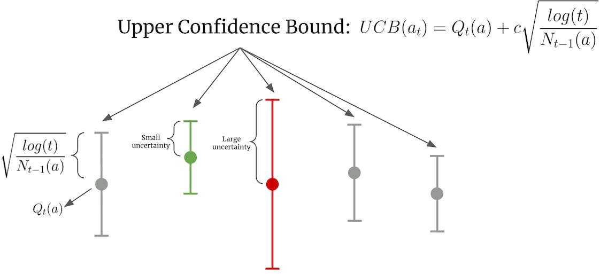

title: NPFL139, Lecture 11
class: title, langtech, cc-by-sa
# UCB, Monte Carlo Tree Search, AlphaZero

## Milan Straka

### April 30, 2024

---
section: UCB
class: section
# Upper Confidence Bound

---
# Upper Confidence Bound

Revisiting multi-armed bandits with $ε$-greedy exploration, we note that using
the same epsilon for all actions in $ε$-greedy method seems inefficient.

~~~
One possible improvement is to select action according to _upper confidence bound_
(instead of choosing a random action with probability $ε$):
$$A_{t+1} ≝ \argmax_a \Bigg[\underbrace{\vphantom{\sqrt{\frac{\ln t}{N_t(a)}}}Q_t(a)}_\textrm{exploitation} + \underbrace{c\sqrt{\frac{\ln t}{N_t(a)}}}_\textrm{exploration}\Bigg],$$
where:
~~~
- $t$ is the number of times any action has been taken;
~~~
- $N_t(a)$ is the number of times the action $a$ has been taken before step $t$;
~~~
- if $N_t(a) = 0$, the right expression is frequently assumed to have a value of
  $∞$.

~~~
The updates are then performed as before (e.g., using averaging or fixed
learning rate $α$).

---
# Upper Confidence Bound



---
# Upper Confidence Bound Derivation

We want to select the upper confidence bound, so that
- the probability of the real expected value being less or equal to the
  confidence bound gradually converges to 1;

~~~
- it is as small as possible.

~~~
Assuming that random variables $X_i$ are bounded by $[0, 1]$ and denoting
$X̄ = \frac{1}{N} ∑_{i=1}^N X_i$, (Chernoff-)Hoeffding's inequality states that
$$P\big(X̄ ≤ 𝔼[X̄] - δ\big) ≤ e^{-2Nδ^2},\textrm{~~which we can rearrange into~~}P\big(X̄ + δ ≤ 𝔼[X̄]).$$

~~~
Our goal is to choose $δ$ such that for every action,
$$P\big(Q_t(a) + δ ≤ q_*(a)\big) ≤ \left(\frac{1}{t}\right)^α.$$

~~~
The required inequality will hold if $e^{-2N_t(a)δ^2} ≤ \left(\frac{1}{t}\right)^α$, yielding
$δ ≥ \sqrt{α/2} ⋅ \sqrt{(\ln t)/N_t(a)}.$

---
# Asymptotic Optimality of UCB

We define **regret** as the difference of maximum of what we could get
(i.e., repeatedly using the action with maximum expectation) and
what a strategy yields, i.e.,
$$\textrm{regret}_N ≝ N \max_a q_*(a) - ∑_{i=1}^N 𝔼[R_i].$$

~~~
It can be shown that regret of UCB is asymptotically optimal,
see Lai and Robbins (1985), _Asymptotically Efficient Adaptive Allocation
Rules_; or the Chapter 8 of the 2018 _Bandit Algorithms Book_ available
online at https://banditalgs.com/.

---
# Upper Confidence Bound Multi-armed Bandits Results


---
# Multi-armed Bandits Comparison


---
section: MCTS
class: section
# Monte Carlo Tree Search

---
# Monte Carlo Tree Search

Assume we want to estimate $Q(s, ⋅)$ for a given state $s$ to decide how to act
in $s$.

~~~
We might perform a lot of simulations from the state $s$ and “promising”
actions. Many simulations will probably share prefixes of the trajectories;
therefore, we might represent these simulations using a _tree_.

~~~


---
# Monte Carlo Tree Search – Selection

When selecting a child to visit, we apply the **UCT** (Upper Confidence Bounds
applied for Trees) method, which chooses an action according to

$$a^* = \argmax_a \left[Q(s, a) + c\sqrt{\frac{\ln N(s)}{N(s, a)}}\right],$$

where:
~~~
- $Q(s, a)$ denotes the average result of playing action $a$ in state $s$ in the
  simulations so far,
~~~
- $N(s)$ is the number of times the state $s$ has been visited in previous
  iterations,
~~~
- $N(s, a)$ is the number of times the action $a$ has been sampled in state $s$.

~~~
The $Q(s, a)$ values are often normalized to the $[0, 1]$ range, and the constant
$c$ is game dependent, but some papers propose to try out $\sqrt 2$ first.

---
# Monte Carlo Tree Search


The MCTS is by nature asymmetrical, visiting promising actions more often.

~~~
## Expansion

Once a chosen action does not correspond to a node in the search tree,
a new leaf is added to the game tree.

~~~
## Simulation

The simulation phase is the “Monte Carlo” part of the algorithm, and is heavily
game-specific. It reaches a terminal state and produces final game outcome.

~~~
## Backpropagation

The obtained outcome updates the $Q(s, a)$ values in the nodes along the path
from the expanded node to the root of the search tree.

---
section: Alpha*
# Alpha* Gradual Development

- AlphaGo

  - Mar 2016 – beat 9-dan professional player Lee Sedol

~~~
- AlphaGo Master – Dec 2016
  - beat 60 professionals, beat Ke Jie in May 2017
~~~
- AlphaGo Zero – 2017
  - trained only using self-play
  - surpassed all previous version after 40 days of training
~~~
- AlphaZero – Dec 2017 (Dec 2018 in Nature)
  - self-play only, defeated AlphaGo Zero after 30 hours of training
  - impressive chess and shogi performance after 9h and 12h, respectively
~~~
- MuZero – Dec 2020 in Nature
  - extends AlphaZero by a _trained model_
~~~
  - later extended into Sampled MuZero capable of handling continuous actions
~~~
- AlphaTensor – Oct 2022 in Nature
  - automatic discovery of faster algorithms for matrix multiplication

---
section: AlphaZero
class: section
# AlphaZero

---
# AlphaZero

On 7 December 2018, the AlphaZero paper came out in Science journal. It
demonstrates learning chess, shogi and go, _tabula rasa_ – without any
domain-specific human knowledge or data, only using self-play. The evaluation
is performed against strongest programs available.


---
# AlphaZero – Overview

AlphaZero uses a neural network predicting $(→p(s), v(s)) ← f(s; →θ)$ for
a given state $s$, where:
- policy $→p(s)$ is a vector of move probabilities, and
~~~
- value function $v(s)$ is the expected outcome of the game in range $[-1, 1]$.

~~~
Instead of the usual alpha-beta search used by classical game playing programs,
AlphaZero uses Monte Carlo Tree Search (MCTS).

~~~
By a sequence of simulated self-play games, the search can improve the estimate
of $→p$ and $v$, and can be considered a powerful policy improvement operator
– given a network $f$ predicting policy $→p$ and value estimate $v$, MCTS
produces a more accurate policy $→π$ and better value estimate $w$ for a given
state $s$:
$$\begin{aligned}
  (→p(s), v(s)) &← f(s; →θ), \\
  (→π(s), w(s)) &← \textrm{MCTS}(s, f)
\end{aligned}$$

---
# AlphaZero – Overview

The network is trained from self-play games.

~~~
A game is played by repeatedly running MCTS from a state $s_t$ and choosing
a move $a_t ∼ →π_t$, until a terminal position $s_T$ is encountered, which is
then scored according to game rules as $z∈\{-1, 0, 1\}$. (Note that the range
$[0, 1]$ is also often used, for example in MuZero.)

~~~
Finally, the network parameters are trained to minimize the error between the
predicted outcome $v$ and the simulated outcome $z$, and maximize the similarity of
the policy vector $→p$ and the search probabilities $→π$ (in other words, we
want to find a fixed point of the MCTS):
$$𝓛 ≝ (z - v)^2 - →π^T \log →p + c\|→θ\|^2.$$

~~~
The loss is a combination of:
- a mean squared error for the value functions;
- a crossentropy for the action distribution;
- $L^2$-regularization.

---
section: A0-MCTS
class: section
# AlphaZero – Monte Carlo Tree Search

---
# AlphaZero – Monte Carlo Tree Search

MCTS keeps a tree of currently explored states from a fixed root state.
~~~
Each node corresponds to a game state and to every non-root node we got
by performing an action $a$ from the parent state.
~~~
Each state-action pair $(s, a)$ stores the following set of statistics:
- visit count $N(s, a)$,
~~~
- total action-value $W(s, a)$,
~~~
- mean action value $Q(s, a) ≝ W(s, a) / N(s, a)$, which is usually not stored
  explicitly,
~~~
- prior probability $P(s, a)$ of selecting the action $a$ in the state $s$.

~~~


---
# AlphaZero – Monte Carlo Tree Search

Each simulation starts in the root node and finishes in a leaf node $s_L$.
In a state $s_t$, an action is selected using a variant of PUCT algorithm as
$$a_t = \argmax\nolimits_a \big(Q(s_t, a) + U(s_t, a)\big),$$
where
~~~
$$U(s, a) ≝ C(s) P(s, a) \frac{\sqrt{N(s)}}{1 + N(s, a)},$$
~~~
with $C(s) = \log\left(\frac{1+N(s)+c_\textrm{base}}{c_\textrm{base}}\right) + c_\textrm{init}$
being slightly time-increasing exploration rate.

~~~
The paper uses $c_\textrm{init} = 1.25$, $c_\textrm{base} = 19652$ without
any (public) supporting experiments.

~~~
The reason for the modification of the UCB formula was never discussed in any
of the AlphaGo/AlphaZero/MuZero papers and is not obvious. However, in June 2020
a paper discussing the properties of this modified formula was published.

---
# AlphaZero – Monte Carlo Tree Search

Additionally, exploration in the root state $s_\textrm{root}$ is supported by
including a random sample from Dirichlet distribution,
$$P(s_\textrm{root}, a) = (1-ε)p_a + ε\operatorname{Dir}(α),$$
with $ε=0.25$ and $α=0.3, 0.15, 0.03$ for chess, shogi and go, respectively.

~~~


Note that using $α<1$ makes the Dirichlet noise non-uniform, with a smaller
number of actions with high probability.

~~~
The Dirichlet distribution can be seen as a limit of the Pólya’s urn scheme,
where in each step we sample from a bowl of balls (with initial counts
$α$) and return an additional ball of the same color to the bowl.

~~~
```python
sorted(np.random.dirichlet([0.3] * 9), reverse=True) ->
0.496 0.139 0.124 0.113 0.066 0.035 0.027 0.000 0.000
0.324 0.250 0.151 0.133 0.068 0.044 0.024 0.005 0.001
0.526 0.222 0.111 0.061 0.035 0.026 0.014 0.005 0.000
```

---
# AlphaZero – Monte Carlo Tree Search


When reaching a leaf node $s_L$, we:
~~~
- evaluate it by the network, generating $(→p, v)$,
~~~
- add all its children with $N=W=0$ and the prior probability $→p$,
~~~
- in the backward pass for all $t ≤ L$, we update the statistics in nodes by performing
  - $N(s_t, a_t) ← N(s_t, a_t) + 1$, and
  - $W(s_t, a_t) ← W(s_t, a_t) ± v$, depending on the player on turn.

---
# AlphaZero – Monte Carlo Tree Search

The Monte Carlo Tree Search runs usually several hundreds simulations in
a single tree. The result is a distribution proportional to exponentiated visit
counts $N(s_\mathrm{root}, a)^\frac{1}{τ}$ using a temperature $τ$ ($τ=1$ is
mostly used), together with the predicted value function.

~~~
The next move is chosen as either:
- proportional to visit counts $N(s_\textrm{root}, ⋅)^\frac{1}{τ}$:
  $$→π_\textrm{root}(a) ∝ N(s_\textrm{root}, a)^\frac{1}{τ},$$
~~~
- deterministically as the most visited action
  $$→π_\textrm{root} = \argmax_a N(s_\textrm{root}, a).$$

~~~
During self-play, the stochastic policy is used for the first 30
moves of the game, while the deterministic is used for the rest of the moves.
(This does not affect the internal MCTS search, there we always sample
according to PUCT rule.)


---
# AlphaZero – Monte Carlo Tree Search Example


Visualization of the 10 most visited states in a MCTS with a given number of
simulations. The displayed numbers are predicted value functions from the
white's perspective, scaled to $[0, 100]$ range. The border thickness is
proportional to a node visit count.

---
section: A0-Network
class: section
# AlphaZero – Network Architecture

---
# AlphaZero – Network Architecture

The network processes game-specific input, which consists of a history of
8 board positions encoded by several $N × N$ planes, and some number of
constant-valued inputs.

~~~
Output is considered to be a categorical distribution of possible moves. For
chess and shogi, for each piece we consider all possible moves (56 queen
moves, 8 knight moves, and 9 underpromotions for chess).

~~~
The input is processed by:
- initial convolution block with CNN with 256 $3×3$ kernels with stride 1, batch
  normalization, and ReLU activation,
~~~
- 19 residual blocks, each consisting of two CNN with 256 $3×3$ kernels with stride 1,
  batch normalization, ReLU activation, and a residual connection around
  them,
~~~
- _policy head_, which applies another CNN with batch normalization, followed by
  a convolution with 73/139 filters for chess/shogi, or a linear layer of size
  362 for go,
~~~
- _value head_, which applies another CNN with one $1×1$ kernel with stride 1,
  followed by a ReLU layer of size 256, and a final $\tanh$ layer of size 1.

---
# AlphaZero – Network Inputs


---
# AlphaZero – Network Outputs


---
section: A0-Training
class: section
# AlphaZero – Training

---
# AlphaZero – Training

Training is performed by running self-play games of the network with itself.
Each MCTS uses 800 simulations. A replay buffer of one million most recent games
is kept.

~~~
During training, 5000 first-generation TPUs are used to generate self-play games.
Simultaneously, network is trained using SGD with momentum of 0.9 on batches
of size 4096, utilizing 16 second-generation TPUs. Training takes approximately
9 hours for chess, 12 hours for shogi and 13 days for go.

---
# AlphaZero – Training


---
# AlphaZero – Training

According to the authors, training is highly repeatable.


---
# AlphaZero – Symmetries

In the original AlphaGo Zero, symmetries (8 in total, using rotations and reflections) were explicitly utilized, by
- randomly sampling a symmetry during training,
~~~
- randomly sampling a symmetry during MCTS evaluation.

~~~
However, AlphaZero does not utilize symmetries in any way (because chess and
shogi do not have them), so it generates only approximately 1/8 positions per training step.


---
section: A0-Evaluation
# AlphaZero – Inference

During inference, AlphaZero utilizes much less evaluations than classical game
playing programs.


---
# AlphaZero – Main Results

Evaluation against strongest program available.


---
# AlphaZero – Ablations


---
# AlphaZero – Ablations


---
# AlphaZero – Ablations


---
# AlphaZero – Preferred Chess Openings


---
section: A0-PT
class: section
# AlphaZero as Regularized Policy Optimization

---
# AlphaZero as Regularized Policy Optimization

Recall that in AlphaZero, actions are selected according to a variant of PUCT
algorithm:
$$a^* = \argmax\nolimits_a \bigg(Q(s, a) + C(s) P(s, a) \frac{\sqrt{N(s)}}{1 + N(s, a)}\bigg),$$
with a slightly time-increasing exploration rate
$C(s) = \log\left(\frac{1+N(s)+19625}{19625}\right) + 1.25 ≈ 1.25$.

~~~
The paper _Jean-Bastien Grill et al.: Monte-Carlo Tree Search as Regularized
Policy Optimization_, the authors have shown how to interpret this algorithm
as a regularized policy optimization.


---
# AlphaZero as Regularized Policy Optimization

Policy optimization is usually an iterative procedure, which in every step
improves a current policy $π_{→θ_0}$ according to
$$π_{→θ'} ≝ \argmax_{→y ∈ 𝓢} →q_{π_{→θ_0}}^T →y - 𝓡(→y, π_{→θ_0}),$$
where $𝓢$ is a $|𝓐|$-dimensional simplex and $𝓡: 𝓢^2 → ℝ$ is an optional
(usually convex) regularization term.

~~~
- with $𝓡 = 0$, the above reduces to policy iteration (used for example in DQN);
~~~
- with $𝓡 = 0$, if the policy is updated using a single gradient step, the
  algorithm reduces to policy gradient;
~~~
- when $𝓡(→y, π_{→θ_0}) = -H(→y)$, we recover the Soft Actor Critic objective;
~~~
- for $𝓡(→y, π_{→θ_0}) = D_\textrm{KL}(π_{→θ_0} \| →y)$ we get an analogue of
  the TRPO objective, which motivated PPO;
~~~
- the MPO algorithm (which we did not discuss) employs $𝓡(→y, π_{→θ_0}) = D_\textrm{KL}(→y \| π_{→θ_0})$.

---
# AlphaZero as Regularized Policy Optimization

Let us define the **empirical visit distribution** $π̂$ as
$$π̂(a|s) ≝ \frac{1 + N(s, a)}{|𝓐| + ∑_b N(s, b)}.$$

~~~
The added plus ones makes the following analysis easier, but are not strictly
necessary.

~~~
We also define the **multiplier** $λ_N$ as
$$λ_N(s) ≝ C(s) ⋅ \frac{\sqrt{∑_b N(s, b)}}{|𝓐| + ∑_b N(s, b)}.$$

~~~
With these definitions, we can rewrite the AlphaZero action selection to
$$a^* = \argmax\nolimits_a \bigg(Q(s, a) + λ_N ⋅ \frac{π_{→θ}(a|s)}{π̂(a|s)}\bigg).$$

---
# AlphaZero as Regularized Policy Optimization

$$a^* = \argmax\nolimits_a \bigg(Q(s, a) + λ_N ⋅ \frac{π_{→θ}(a|s)}{π̂(a|s)}\bigg)$$

For notational simplicity, we will represent $Q(s, a)$ as a vector $→q$, where
$q_a = Q(s, a)$, and similarly the policies as $→π_{→θ}$, $→π̂$.

~~~
Furthermore, for two vectors $→a, →b$, let $\frac{→a}{→b}$ denote element-wise
division with $(\frac{→a}{→b})_i ≝ \frac{a_i}{b_i}.$ 

~~~
With this notation, the action selection can be succinctly written as
$$a^* = \argmax\nolimits_a \Big(→q + λ_N \frac{→π_{→θ}}{→π̂}\Big).$$

---
# AlphaZero as Regularized Policy Optimization

Let $→π̄$ be the solution of the following objective:
$$→π̄ ≝ \argmax\nolimits_{→y ∈ 𝓢} \Big(→q^T →y - λ_N D_\textrm{KL}(→π_{→θ} \| →y)\Big).$$

~~~
It can be shown that this solution can be computed explicitly as
$$→π̄ = λ_N \frac{→π_{→θ}}{α - →q},$$
where $α ∈ ℝ$ is set such that the result is a proper distribution.
~~~
- Note that $α ≥ \max_{b∈𝓐} \big(q_b + λ_N π_{→θ}(b)\big)$, because $π̄(a)$ must
  be at most 1.
~~~
- Furthermore, $α ≤ \max_{b∈𝓐} (q_b) + λ_N$, because we need $∑_a π̄(a) = 1$
  and we combine $∑_a \frac{λ_N π_{→θ}(a)}{\max_b (q_b) + λ_N - q_a} ≤ ∑_a \frac{λ_N π_{→θ}(a)}{λ_N} = 1$
  with the fact that $∑_a \frac{λ_N π_{→θ}(a)}{α - q_a}$ is a decreasing
  function of $α ≥ \max_b q_b$.

~~~
Note the $λ_N ≈ 1/\sqrt N$ decreasing the regularization for increasing number
of simulations.

---
# AlphaZero as Regularized Policy Optimization

In the paper, it is proven that the action $a^*$ selected by the AlphaZero algorithm fulfills
$$a^* = \argmax\nolimits_a \bigg(\frac{∂}{∂ N(s, a)} \Big(→q^T →π̂ - λ_N D_\textrm{KL}(→π_{→θ} \| →π̂)\Big)\bigg).$$

~~~
In other words, $π̂$ “tracks” $π̄$.

~~~
Furthermore, it can be also shown that for the selected action $a^*$,
$$π̂(a^*|s) ≤ π̄(a^* | s),$$
until in the limit, the two distributions coincide.

---
# AlphaZero as Regularized Policy Optimization

The $π̄$ can be used in the AlphaZero algorithm in several ways:

- **Act**: the action in self-play games could be sampled according to
  $π̄(⋅|s_\textrm{root})$ instead of $π̂$;

~~~
- **Search**: during search, we could sample the actions stochastically
  according to $π̄$ instead of the PUCT rule;
~~~
- **Learn**: we could use $π̄$ as the target policy during training instead
  of $π̂$;
~~~
- **All**: all of the above.

---
# AlphaZero as Regularized Policy Optimization


---
# AlphaZero as Regularized Policy Optimization


---
# AlphaZero as Regularized Policy Optimization


