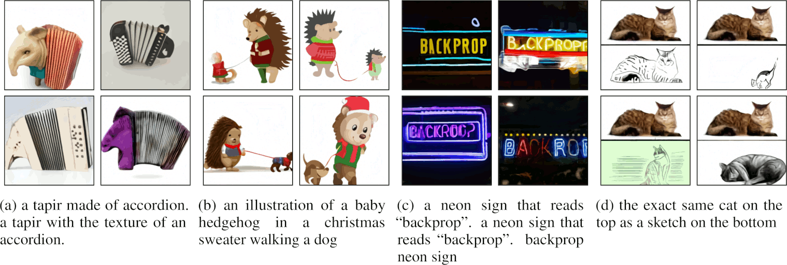

title: NPFL139, Lecture 13
class: title, langtech, cc-by-sa
# PlaNet, ST and Gumbel-softmax, DreamerV2+3

## Milan Straka

### May 12, 2026

---
section: PlaNet
class: section
# PlaNet

---
# PlaNet

In Nov 2018, an interesting paper from D. Hafner et al. proposed
a **Deep Planning Network (PlaNet)**, which is a model-based agent
that learns the MDP dynamics from pixels, and then chooses actions
using a CEM planner utilizing the learned compact latent space.

~~~
The PlaNet is evaluated on selected tasks from the DeepMind control suite

---
# PlaNet

In PlaNet, partially observable MDPs following the stochastic dynamics are
considered:
$$\begin{aligned}
\textrm{transition function:} && s_t &∼p(s_t|s_{t-1},a_{t-1}), \\
\textrm{observation function:} && o_t &∼p(o_t|s_t), \\
\textrm{reward function:} && r_t &∼p(r_t|s_t), \\
\textrm{policy:} && a_t &∼p(a_t|o_{≤t},a_{< t}).
\end{aligned}$$

~~~
The main goal is to train the first three—the transition function, the
observation function, and the reward function.

---
# PlaNet – Data Collection

Because an untrained agent will most likely not cover all needed environment
states, we need to iteratively collect new experience and train the model.
The authors propose $S=5$, $C=100$, $B=50$, $L=50$, $R$ between 2 and 8.

~~~
For planning, CEM algorithm (capable of solving all tasks with a true model)
is used; $H=12$, $I=10$, $J=1000$, $K=100$.

---
section: LatentModel
# PlaNet – Latent Dynamics

First let us consider a typical latent-space model, consisting of
$$\begin{aligned}
\textrm{transition function:} && s_t &∼p(s_t|s_{t-1},a_{t-1}), \\
\textrm{observation function:} && o_t &∼p(o_t|s_t), \\
\textrm{reward function:} && r_t &∼p(r_t|s_t).
\end{aligned}$$

~~~
The transition model is Gaussian with mean and variance predicted by a network,
the observation model is Gaussian with identity covariance and mean predicted by
a deconvolutional network, and the reward model is a scalar Gaussian with unit
variance and mean predicted by a neural network.

~~~
To train such a model, we turn to variational inference, and use an
encoder $q(s_{1:T}|o_{1:T},a_{1:T-1})=∏_{t=1}^\T q(s_t|s_{t-1},a_{t-1},o_t)$,
which is a Gaussian with mean and variance predicted by a convolutional neural
network.

---
# PlaNet – Training Objective

Using the encoder, we obtain the following variational lower bound on the
log-likelihood of the observations (for rewards the bound is analogous):
$$\begin{aligned}
  &\log p(o_{1:T}|a_{1:T}) \\
  &\quad = \log ∫ ∏_t p(s_t|s_{t-1},a_{t-1}) p(o_t|s_t)\d s_{1:T} \\
  &\quad ≥ ∑_{t=1}^\T \Big(
    \underbrace{𝔼_{q(s_t|o_{\leq t},a_{< t})} \log p(o_t|s_t)}_\textrm{reconstruction} -
    \underbrace{𝔼_{q(s_{t-1}|o_{≤ t-1},a_{<t-1})} D_\textrm{KL}\big(q(s_t|o_{≤ t},a_{< t}) \| p(s_t|s_{t-1},a_{t-1})\big)}_\textrm{complexity}
  \Big).
\end{aligned}$$

~~~
We evaluate the expectations using a single sample, and use the reparametrization
trick to allow backpropagation through the sampling.

---
# PlaNet – Training Objective Derivation

To derive the training objective, we employ importance sampling and the Jensen’s
inequality:  
 

$\displaystyle \quad\log p(o_{1:T}|a_{1:T})$

$\displaystyle \qquad= \log 𝔼_{p(s_{1:T}|a_{1:T})} ∏_{t=1}^\T p(o_t|s_t)$

~~~
$\displaystyle \qquad= \log 𝔼_{q(s_{1:T}|o_{1:T},a_{1:T})} ∏_{t=1}^\T p(o_t|s_t) p(s_t|s_{t-1},a_{t-1}) / q(s_t|o_{≤ t},a_{< t})$

~~~
$\displaystyle \qquad≥ 𝔼_{q(s_{1:T}|o_{1:T},a_{1:T})} ∑_{t=1}^\T \log p(o_t|s_t) + \log p(s_t|s_{t-1},a_{t-1}) - \log q(s_t|o_{≤ t},a_{< t})$

~~~
$\displaystyle \quad= \mathrlap{∑_{t=1}^\T \Big(
  \underbrace{𝔼_{q(s_t|o_{\leq t},a_{< t})} \log p(o_t|s_t)}_\textrm{reconstruction} -
  \underbrace{𝔼_{q(s_{t-1}|o_{≤ t-1},a_{<t-1})} D_\textrm{KL}\big(q(s_t|o_{≤ t},a_{< t}) \| p(s_t|s_{t-1},a_{t-1})\big)}_\textrm{complexity}
\Big).}$

---
section: RSSM
# PlaNet – Recurrent State-Space Model

The purely stochastic transitions struggle to store information for multiple
timesteps. Therefore, the authors propose to include a deterministic path to the
model (providing access to all previous states), obtaining the
**recurrent state-space model (RSSM)**:

~~~
$$\begin{aligned}
\textrm{deterministic state model:} && h_t &= f(h_{t-1}, s_{t-1}, a_{t-1}), \\
\textrm{stochastic state function:} && s_t &∼p(s_t|h_t), \\
\textrm{observation function:} && o_t &∼p(o_t|h_t, s_t), \\
\textrm{reward function:} && r_t &∼p(r_t|h_t, s_t), \\
\textrm{encoder:} && q_t &∼q(s_t|h_t, o_t).
\end{aligned}$$

---
# PlaNet – Results

---
# PlaNet – Ablations

---
# PlaNet – Ablations

Random collection: random actions; random shooting: best action out of 1000 random seqs.

---
section: ST
class: section
# Straight-Through (ST) Estimator

---
# Discrete Latent Variables

Consider that we would like to have discrete neurons on the hidden layer
of a neural network.

~~~
Note that on the output layer, we relaxed discrete prediction (i.e.,
an $\argmax$) with a continuous relaxation – $\softmax$. This way, we can
compute the derivatives and also predict the most probable class.
(It is possible to derive $\softmax$ as an entropy-regularized $\argmax$.)

~~~
However, on a hidden layer, we also need to _sample_ from the predicted
categorical distribution, and then backpropagate the gradients.

---
# Stochastic Gradient Estimators

---
# Stochastic Gradient Estimators

Consider a model with a discrete categorical latent variable $→z$ sampled from
$p(→z; →θ)$, with a loss $L(→z; →ω)$.
~~~
Several gradient estimators have been proposed:

- A REINFORCE-like gradient estimation.

~~~
  Using the identity $∇_{→θ} p(→z; →θ) = p(→z; →θ) ∇_{→θ} \log p(→z; →θ)$, we
  obtain that
~~~
  $$∇_{→θ} 𝔼_{→z} \big[L(→z; →ω)\big] = 𝔼_{→z} \big[L(→z; →ω) ∇_{→θ} \log p(→z; →θ)\big].$$

~~~
  Analogously as before, we can also include the baseline for variance
  reduction, resulting in
  $$∇_{→θ} 𝔼_{→z} \big[L(→z; →ω)\big] = 𝔼_{→z} \big[(L(→z; →ω) - b) ∇_{→θ} \log p(→z; →θ)\big].$$

~~~
- A **straight-through (ST)** estimator.

  The straight-through estimator has been proposed by Y. Bengio in 2013. It is
  a biased estimator, which assumes that $∇_{→θ} →z ≈ ∇_{→θ} p(→z; →θ)$, which implies
  $∇_{p(→z; →θ)} →z ≈ 1$. Even if the bias can be considerable, it seems to work
  quite well in practice.

---
section: Gumbel-Softmax
class: section
# Gumbel-Softmax

---
# Gumbel-Softmax

The **Gumbel-softmax** distribution was proposed independently in two papers
in Nov 2016 (under the name of **Concrete** distribution in the other paper).

~~~
It is a continuous distribution over the simplex (over categorical
distributions) that can approximate _sampling_ from a categorical distribution.

~~~
Let $z$ be a categorical variable with class probabilities $→p = (p_1, p_2, …, p_K)$.

~~~
Recall that the Gumbel-Max trick (based on a 1954 theorem from E. J. Gumbel) states that
we can draw samples $z ∼ →p$ using
$$z = \operatorname{one-hot}\Big(\argmax_i \big(g_i + \log p_i\big)\Big),$$
where $g_i$ are independent samples drawn from the $\operatorname{Gumbel}(0, 1)$
distribution.

To sample $g$ from the distribution $\operatorname{Gumbel}(0, 1)$, we can sample
$u ∼ U(0, 1)$ and then compute $g = -\log(-\log u)$.

---
# Gumbel-Softmax

To obtain a continuous distribution, we relax the $\argmax$ into a $\softmax$
with temperature $T$ as
$$z_i = \frac{e^{(g_i + \log p_i)/T}}{∑_j e^{(g_j + \log p_j)/T}}.$$

~~~
As the temperature $T$ goes to zero, the generated samples become one-hot, and
therefore the Gumbel-softmax distribution converges to the categorical
distribution $p(z)$.

---
# Gumbel-Softmax Estimator

The Gumbel-softmax distribution can be used to reparametrize the sampling of the
discrete variable using a fully differentiable estimator.

~~~
However, the resulting sample is not discrete, it only converges to a discrete
sample as the temperature $T$ goes to zero.

~~~
If it is a problem, we can combine the Gumbel-softmax with a straight-through estimator,
obtaining ST Gumbel-softmax, where we:
- discretize $→y$ as $→z = \argmax →y$,
~~~
- assume $∇_{→θ}→z ≈ ∇_{→θ}→y$, or in other words, $\frac{∂→z}{∂→y} ≈ 1$.

---
# Gumbel-Softmax Estimator Results

---
# Applications of Discrete Latent Variables

The discrete latent variables can be used among others to:
- allow the SAC algorithm to be used on **discrete** actions,
  using either Gumbel-softmax relaxation (if the critic takes
  the actions as binary indicators, it is possible to pass not
  just one-hot encoding, but the result of Gumbel-softmax directly),
  or a straight-through estimator;

~~~
- model images using discrete latent variables
  - VQ-VAE, VQ-VAE-2 use “codebook loss” with a straight-through estimator

    

---
# Applications of Discrete Latent Variables

- VQ-GAN combines the VQ-VAE and Transformers, where the latter is used
  to generate a sequence of the _discrete_ latents.

---
class: center
# Applications of Discrete Latent Variables – VQ-GAN

<video controls style="width: 90%">
  <source src="https://github.com/CompVis/taming-transformers/raw/9539a92f08ebea816ec6ddecb2dedd6c8664ef08/images/taming.mp4" type="video/mp4">
</video>

---
# Applications of Discrete Latent Variables – DALL-E

- In DALL-E, Transformer is used to model a sequence of words followed by
  a sequence of the discrete image latent variables.

  The Gumbel-softmax relaxation is used to train the discrete latent states,
  with temperature annealed with a cosine decay from 1 to 1/16 over the first
  150k (out of 3M) updates.

---
section: 😴DreamerV2
class: section
# DreamerV2

---
# DreamerV2

The PlaNet model was followed by Dreamer (Dec 2019) and DreamerV2 (Oct 2020),
which train an agent using reinforcement learning using the model alone.
After 200M environment steps, it surpasses Rainbow on a collection of 55
Atari games (the authors do not mention why they do not use all 57 games)
when training on a single GPU for 10 days per game.

~~~
During training, a policy is learned from 486B compact states “dreamed”
by the model, which is 10,000 times more than the 50M observations from
the real environment (with action repeat 4).

~~~
Interestingly, the latent states are represented as a vector of several
**categorical** variables – 32 variables with 32 classes each are utilized in
the paper.

---
# DreamerV2 – Model Learning

The model in DreamerV2 is learned using the RSSM, collecting agent experiences
of observations, actions, rewards, and discount factors (0.995 within episode
and 0 at an episode end). Training is performed on batches of 50 sequences
of length at most 50 each.

~~~

$$\begin{aligned}
\textrm{recurrent model:}      && h_t &= f_φ(h_{t-1},s_{t-1},a_{t-1}), \\
\textrm{representation model:} && s_t &∼ q_φ(s_t | h_t,x_t), \\
\textrm{transition predictor:} && s̄_t &∼ p_φ(s̄_t | h_t), \\
\textrm{image predictor:}      && x̄_t &∼ p_φ(x̄_t | h_t,s_t), \\
\textrm{reward predictor:}     && r̄_t &∼ p_φ(r̄_t | h_t,s_t), \\
\textrm{discount predictor:}     && γ̄_t &∼ p_φ(γ̄_t | h_t,s_t).
\end{aligned}$$

~~~

---
# DreamerV2 – Model Learning

The following loss function is used:

$$\begin{aligned}
𝓛(φ) = 𝔼_{q_φ(s_{1:T} | a_{1:T}, x_{1:T})}\Big[∑\nolimits_{t=1}^\T &
  \underbrace{-\log p_φ(x_t | h_t,s_t)}_\textrm{image log loss}
  \underbrace{-\log p_φ(r_t | h_t,s_t)}_\textrm{reward log loss}
  \underbrace{-\log p_φ(γ_t | h_t,s_t)}_\textrm{discount log loss} \\
 &\underbrace{+β D_\textrm{KL}\big[q_φ(s_t | h_t,x_t) \| p_φ(s_t | h_t)\big]}_\textrm{KL loss}
\Big].
\end{aligned}$$

~~~
In the KL term, we train both the prior and the encoder. However, regularizing
the encoder towards the prior makes training harder (especially at the
beginning), so the authors propose **KL balancing**, minimizing the KL term
faster for the prior ($α=0.8$) than for the posterior.

---
# DreamerV2 – Policy Learning

The policy is trained solely from the model, starting from the encountered
posterior states and then considering $H=15$ actions simulated in the compact
latent state.

~~~
We train an actor predicting $π_ψ(a_t | s_t)$ and a critic predicting
$$\textstyle v_ξ(s_t) = 𝔼_{p_φ, π_ψ} \big[∑_{r ≥ t} (∏_{r'=t+1}^r γ_{r'}) r_t\big].$$

~~~
The critic is trained by estimating the truncated $λ$-return as
$$V_t^λ = r_t + \gamma_t\begin{cases}
  (1 - λ) v_ξ(\hat{z}_{t+1}) + λ V_{t+1}^λ & \textrm{if~~}t<H, \\
  v_ξ(\hat{z}_H) & \textrm{if~~}t=H. \\
\end{cases}$$
and then minimizing the MSE.

---
# DreamerV2 – Policy Learning

The actor is trained using two approaches:
- the REINFORCE-like loss (with a baseline), which is unbiased, but has a high
  variance (even with the baseline);
~~~
- the reparametrization of discrete actions using a straight-through gradient
  estimation, which is biased, but has lower variance.

~~~
$$\begin{aligned}
𝓛(ψ) = 𝔼_{p_φ,π_ψ}\Big[∑\nolimits_{t=1}^{H-1} \big(&
    \underbrace{-ρ \log π_ψ(a_t|s_t)\operatorname{stop\char`_gradient}(V_t^λ-v_ξ({s_t}))}_\textrm{reinforce} \\
   &\underbrace{-(1-ρ) V_t^λ}_\textrm{dynamics backprop}\,\,
    \underbrace{-η H(a_t|s_t)}_\textrm{entropy regularizer}\big)\Big]
\end{aligned}$$

~~~
For Atari domains, authors use $ρ = 1$ and $η=10^{-3}$ (they say it works
“substantially better”), while for continuous actions, $ρ = 0$ works
“substantially better” (presumably because of the bias in case of discrete
actions) and $η=10^{-4}$ is used.

---
# DreamerV2 – Results

The authors evaluate on 55 Atari games. They argue that the commonly used
metrics have various flaws:
- **gamer-normalized median** ignores scores on half of the games,
- **gamer-normalized mean** is dominated by several games where the agent
  achieves super-human performance by several orders.

~~~
They therefore propose two additional ones:
- **record-normalized mean** normalizes with respect to any registered human
  world record for each game; however, in some games the agents still achieve
  super-human-record performance;
- **clipped record-normalized mean** additionally clips each score to 1;
  this measure is used as the primary metric in the paper.

---
# DreamerV2 – Results

Scheduling anneals actor entropy loss scale and actor gradient mixing $ρ$.

---
# DreamerV2 – Ablations

---
# DreamerV2 – Discrete Latent Variables

Categorical latent variables outperform Gaussian latent variables on 42 games,
tie on 5 games and decrease performance on 8 games (where a tie is defined as
being within 5\%).

The authors provide several hypotheses why could the categorical latent
variables be better:
- Categorical prior can perfectly match aggregated posterior, because mixture of
  categoricals is categorical, which is not true for Gaussians.

~~~
- Sparsity achieved by the 32 categorical variables with 32 classes each could
  be beneficial for generalization.

~~~
- Contrary to intuition, optimizing categorical variables might be easier than
  optimizing Gaussians, because the straight-through estimator ignores a term
  which would otherwise scale the gradient, which could reduce
  exploding/vanishing gradient problem.

~~~
- Categorical variables could be a better match for modeling discrete aspect
  of the Atari games (defeating an enemy, collecting reward, entering a room, …).

---
# DreamerV2 – Comparison, Hyperparametres

~~~

---
section: 😴DreamerV3
class: section
# DreamerV3

---
# DreamerV3

---
# DreamerV3

---
# DreamerV3

---
# DreamerV3

---
style: .katex-display { margin: .8em 0 }
# DreamerV3

To be able to predict rewards and returns in different scales, the authors
propose to use symmetrical and shifted logarithm:

$$\begin{aligned}
  \operatorname{symlog}(x) &≝ \sign(x)\log\big(|x| + 1\big), \\
  \operatorname{symexp}(x) &≝ \sign(x)\big(\exp(|x|) - 1\big). \\
\end{aligned}$$

~~~
The loss could then be
$$𝓛(→θ) ≝ \tfrac{1}{2} \big(f(→x; →θ) - \operatorname{symlog}(y)\big)^2,$$

~~~
and we can reconstruct the original quantity as
$$ŷ ≝ \operatorname{symexp}\big(f(→x; →θ)\big).$$

~~~
We can use this approach to predict also a whole distribution, trained using twohot loss:
$$B ≝ \operatorname{symexp}\big([-20, …, 20]\big),~~~~~ŷ ≝ \softmax\big(f(→x; →θ)\big)^\T B,~~~~~𝓛(→θ) ≝ -\operatorname{twohot}^\T \log ŷ.$$

---
# DreamerV3

The world model is the same as in DreamerV2, here using the original notation:
$$\begin{aligned}
\textrm{RSSM}~~ & \textrm{sequence model:}      && h_t = f_φ(h_{t-1},s_{t-1},a_{t-1}), \\
\textrm{RSSM}~~ & \textrm{encoder:}             && s_t ∼ q_φ(s_t | h_t,x_t), \\
\textrm{RSSM}~~ & \textrm{dynamics predictor:}  && s̄_t ∼ p_φ(s̄_t | h_t), \\
& \textrm{decoder:}             && x̄_t ∼ p_φ(x̄_t | h_t,s_t), \\
& \textrm{reward predictor:}    && r̄_t ∼ p_φ(r̄_t | h_t,s_t), \\
& \textrm{continue predictor:}  && c̄_t ∼ p_φ(c̄_t | h_t,s_t).
\end{aligned}$$

~~~
The observations are transformed using the $\operatorname{symlog}$ function,
both on the encoder input and decoder targets.

---
# DreamerV3

The overall world model loss is:
$$𝓛(→φ) ≝ 𝔼_{q_φ} \Big[∑_{t=1}^\T\big(
  \underbrace{β_\textrm{pred}}_{1.0} 𝓛_\textrm{pred}(→φ)
+ \underbrace{β_\textrm{dyn}}_{1.0} 𝓛_\textrm{dyn}(→φ)
+ \underbrace{β_\textrm{rep}}_{0.1} 𝓛_\textrm{rep}(→φ)\big)\Big],$$

~~~
where the individual components are
$$\begin{aligned}
𝓛_\textrm{pred}(→φ) &≝ -\log p_{→φ}(x_t | h_t, s_t) -\log p_{→φ}(r_t | h_t, s_t) -\log p_{→φ}(c_t | h_t, s_t), \\
𝓛_\textrm{dyn}(→φ) &≝ \max\Big(1, D_\textrm{KL}\big(\operatorname{sg}(q_{→θ}(s_t | h_t, x_t)) \big\| \hphantom{\operatorname{sg}(\,}p_{→φ}(s_t | h_t)\hphantom{)}\big)\Big), \\
𝓛_\textrm{rep}(→φ) &≝ \max\Big(1, D_\textrm{KL}\big(\hphantom{\operatorname{sg}(\,}q_{→θ}(s_t | h_t, x_t)\hphantom{)} \big\| \operatorname{sg}(p_{→φ}(s_t | h_t))\big)\Big). \\
\end{aligned}$$

~~~
To stabilize training, the authors use _free bits_ (clipping the dynamics and
representation losses below 1 nat ≈ 1.44 bits) and parametrize the categorical
distributions of the encoder, dynamics predictor, and actor distribution
as a mixture of 1% uniform and 99% neural network output.

---
# DreamerV3

The critic is trained to predict from the current state
$z_t=\{h_t, s_t/s̄_t\}$ the return $v_t(z_t; →φ)$ as a categorical distribution
over exponentially spaced bins $B$.

~~~
As target, the boostrapped $λ$-return is used during training:
$$R_t^λ ≝ r_t + γ c̄_t \big((1-λ) v_t + λ R_{t+1}^λ\big),$$
where for the imaginary horizon $T=16$, we use just the bootstrapped
return $R_T^λ ≝ v_T$.

~~~
The critic is trained using a mixture of imaginary trajectories $\{h_t, s̄_t\}$
with loss scale $β_\mathit{val}=1$ and trajectories sample from the replay
buffer $\{h_t, s_t\}$ with loss scale $β_\mathit{repval}=0.3$.

~~~
The training is stabilized by a regularization loss of the critic to its
exponentially moving average of its own parameters, allowing to use the current
network for computing the returns.

---
style: .katex-display { margin: .4em 0 }
# DreamerV3

The actor is trained using entropy-regularized REINFORCE loss, for both discrete
and continuous actions:
$$𝓛(→θ) ≝ -∑_{t=1}^\T \operatorname{sg}\big((R_t^λ - v_t(z_t; →φ) / \max(1, S)\big) \log π(a_t | z_t; →θ) + ηH\big[π(a_t | s)t; →θ)\big],$$

~~~
where the returns are normalized using
$$S ≝ \operatorname{EMA}\big(\operatorname{Quantile}(R_t^λ, 0.95)-\operatorname{Quantile}(R_t^λ, 0.05), 0.99\big).$$

~~~
During training, uniform sampling is used, even if authors mention that
prioritized replay improved performance.

~~~
Each batch is a combination of online data (from the current interactions)
and data sampled from the replay buffer and then followed by the actor and the
world model.

~~~
The _replay ratio_ is the number of time steps trained for every single step
collected from the environment (without action repeat); e.g., for a replay
ratio of 32, action repeat (frame skip) 4, and batches of 64 sequences of 16
steps, a gradient update is performed every  
$4 ⋅ 64 ⋅ 16\,/\,32 = 128$ environment steps.

---
# DreamerV3

---
# DreamerV3

---
# DreamerV3

---
# DreamerV3

---
# DreamerV3

