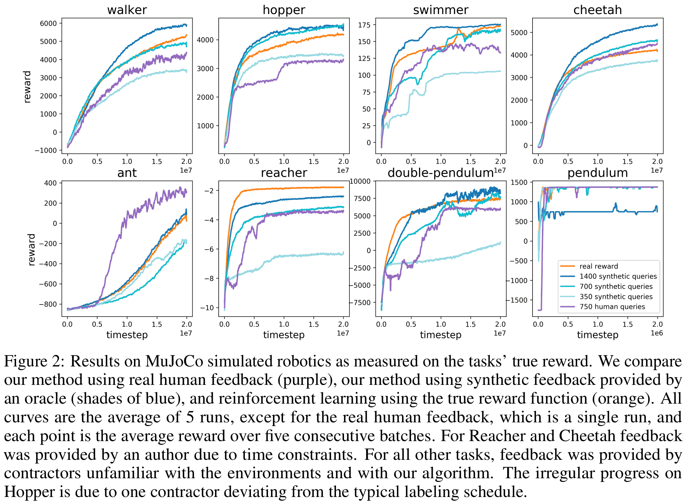
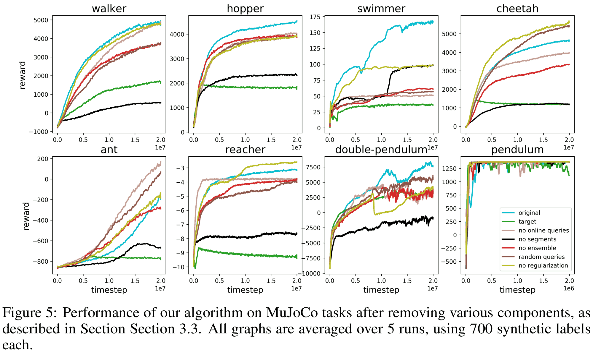

title: NPFL139, Lecture 14
class: title, langtech, cc-by-sa
# Multi-Agent RL, RL from Human Feedback

## Milan Straka

### May 21, 2025

---
section: MARL
class: section
# Multi-Agent Reinforcement Learning

---
# Partially Observable MDPs

Recall that a **partially observable Markov decision process** extends the
Markov decision process to a sextuple $(𝓢, 𝓐, p, γ, 𝓞, o)$, where the MDP
components
- $𝓢$ is a set of states,
- $𝓐$ is a set of actions,
- $p(S_{t+1} = s', R_{t+1} = r | S_t = s, A_t = a)$ is a probability that
  action $a ∈ 𝓐$ will lead from state $s ∈ 𝓢$ to $s' ∈ 𝓢$, producing a **reward** $r ∈ ℝ$,
- $γ ∈ [0, 1]$ is a **discount factor**,

are extended by:
- $𝓞$ is a set of observations,
- $o(O_{t+1} | S_{t+1}, A_t)$ is an observation model, where observation $O_t$
  is used as agent input instead of the state $S_t$.

---
# Partially Observable Stochastic Game

A **partially observable stochastic game (POSG)** is a 9-tuple
$(𝓢, N, \{𝓐^{i∈[N]}\}, \{Ω^{i∈[N]}\}, \{R^{i∈[N]}\}, P, \{O^{i∈[N]}\}, ρ_0, γ)$, where

~~~
- $𝓢$ is the set of all possible _states_,
~~~
- $N$ is the _number of agents_,
~~~
- $𝓐^{i}$ is the set of all possible _actions_ for agent
  $i$, with $𝓐^Π ≝ ∏_i 𝓐^i$,
~~~
- $Ω^{i}$ is the set of all possible _observations_ for agent $i$,
~~~
- $P(s_{t+1} ∈ 𝓢 | s_t ∈ 𝓢, →a_t ∈ 𝓐^Π)$ is the _transition model_,
~~~
- $R^{i} : 𝓢 × 𝓐^Π × 𝓢 → ℝ$ is the _reward function_ for agent $i$,
~~~
- $O^{i}(ω^i_{t+1} ∈ Ω^i | s_{t+1} ∈ 𝓢, a^i_t ∈ 𝓐)$ is the _observation model_ for agent $i$,
  a distribution of observing $w^i_{t+1}$ after performing action $a^i_t$
  leading to state $s_{t+1}$,
~~~
- $ρ_{0}$ is the _initial state distribution_,
~~~
- $γ ∈ [0, 1]$ is a _discount factor_.

---
# Partially Observable Stochastic Game

We denote
- joint actions/policy/observation across all agents as vectors
  $$→a ≝ (a^1, …, a^N) ∈ 𝓐^Π,$$
~~~
- joint actions/policy/observation for all agents but agent $i$ as
  $$→a^{-i} ≝ (a^1, …, a^{i-1}, a^{i+1}, …, a^N),$$

---
# Agent-Environment Cycle Game

However, when actually implementing POSG, various ambiguities exist in the
order of execution. Therefore, **agent-environment cycle game (AECG)** has been
proposed,  
a 12-tuple $(𝓢, N, \{𝓐^{i∈[N]}\}, \{Ω^{i∈[N]}\}, \{R^{i∈[N]}\}, \{T^{i∈[N]}\}, P, \{O^{i∈[N]}\}, ν, s_0, i_0, γ)$ where

~~~
- $𝓢$ is the set of all possible _states_,
~~~
- $N$ is the _number of agents_, including $0$ for “environment” agent; $[N^∪] ≝ [N] \cup \{0\}$,
~~~
- $𝓐^{i}$ is the set of all possible _actions_ for agent $i$, with $𝓐^0 ≝ \{∅\}$, $𝓐^∪ ≝ \bigcup_{i∈[N^∪]} 𝓐^i$,
~~~
- $Ω^{i}$ is the set of all possible _observations_ for agent $i$,
~~~
- $T^{i} : 𝓢 × 𝓐^i → 𝓢$ is the deterministic _transition function_ for agent $i$,
~~~
- $P(s_{t+1} ∈ 𝓢 | s_t ∈ 𝓢)$ is the transition function for the environment,
~~~
- $R^{i}(r^i_{t+1} ∈ ℝ | s_t ∈ 𝓢, j ∈ [N^∪], a^j_t ∈ 𝓐^j, s_{t+1} ∈ 𝓢)$ is the _reward distribution_ for agent $i$,
~~~
- $O^{i}(ω^i_{t+1} ∈ Ω^i | s_{t+1} ∈ 𝓢)$ is the _observation model_ for agent $i$,
~~~
- $ν(j ∈ [N^∪] | s_t ∈ 𝓢, i ∈ [N^∪], a^i_t ∈ 𝓐^i)$ is the _next agent function_,
~~~
- $s_{0} ∈ 𝓢$ is the _initial state_,
~~~
- $i_{0} ∈ [N^U]$ is the _initial agent_,
~~~
$\,∙\,\,\,γ ∈ [0, 1]$ is a _discount factor_.

---
# Agent-Environment Cycle Game

It holds that for every POSG, there is an equivalent AECG, and vice versa.

~~~
- When starting with POSG, a single transition is represented as N+1 steps in
  AECG: first the N agents sequentially act, storing all their actions in the
  state, and then the environment performs the same transition as the POSG.

~~~
- Starting with AECG, we design POSG where the state is a triple _(AECG state,
  actor to act, reward to obtain)_, and every transition is one step from AECG.

---
# Environment Settings

Depending on the reward function, there are several environment settings:

~~~
- **fully cooperative**, when $∀i, ∀j: R^i(s_t, →a_t, s_{t+1}) = R^j(s_t, →a_t, s_{t+1})$;

~~~
- **zero-sum**, when $∑_{i∈[N]} R^i(s_t, →a_t, s_{t+1}) = 0$.

~~~
Informally, we talk about **cooperative** and **competitive** settings, but we
refrain from defining them exactly (the definitions that we had were incorrect).

---
# The MARL Problem

We define a trajectory $→τ$ as a sequence of states and actions
$$→τ ≝ (s_0, →a_0, s_1, →a_1, s_2, …),$$
where:
~~~
- $s_0 ∼ ρ_0$,
~~~
- $→a_t ∼ →π(⋅|s_t)$,
~~~
- $s_{t+1} → P(⋅|s_t, →a_t)$.

~~~
A return for an agent $i$ and trajectory $→τ$ is
$$R^i(→τ) ≝ ∑_{t=0}^{|→τ|} γ^t r^i_{t+1}.$$

---
# The MARL Problem

For a given policy $→π$, the expected return for agent $i$ is
$$J^i(→π) ≝ 𝔼_{→τ ∼ →π} \big[R^i(→τ)\big],$$
~~~
where a probability of a trajetory $→τ$ is
$$P(→τ | →π) ≝ ρ_0(s_0) ∏_{t=0}^{|→τ|} P(s_{t+1} | s_t, →a_t) →π(→a_t | s_t).$$ 

~~~
For a given joing policy $→π^{-i}$, **best response** is
$$π̂^i(→π^{-i}) ≝ \argmax_{π_i} J^i(π^i, →π^{-i}).$$

---
style: .halftable { display: inline-block; width: 49% } .halftable table {margin: auto; line-height: 1} .halftable th { text-align: center !important }
# The MARL Goal

It is unfortunately not clear what the goal of MARL should be, given that it is
a multi-criterion optimization problem.

~~~
One possibility is to seek for **Nash equilibrium**, which is a joint policy $→π_*$
fulfilling
$$∀ i ∈[N], ∀ π^i: J^i(→π_*) ≥ J^i(π^i, →π^{-i}_*).$$

~~~
In other words, $π^i_*$ is a best response to $→π^{-i}_*$ for all agents $i$.

~~~
A Nash equilibrium exists for any finite game (finite number of players, each
with a finite number of strategies).
~~~
Unfortunately, there can be multiple Nash equilibria with different payoffs
(Nash equilibrium is just a “local” optimum).

~~~

- Stag hunt

| A\B | Stag | Rabbit |
|:---|:--:|:--:|
| Stag | 2\2 | 0\1 |
| Rabbit | 1\0 | 1\1 |

~~~

- Prisoner's dilemma

| A\B | Stay silent | Testify |
|:---|:--:|:--:|
| Stay silent | -1\\-1 | -3\\0 |
| Testify | 0\\-3 | -2\\-2 |

---
section: MARL Schemes
class: section
# MARL Training Schemes

---
# MARL Training Schemes

## Centralized Scheme

A joint model for all agents, a single critic.

---
# MARL Training Schemes

## Concurrent/Parameter-Sharing Scheme

Each agent is trained independently. When the agents are homogenous, their
models can be optionally shared (the _parameter-sharing scheme_).

However, the environment is then non-stationary, and using a replay buffer is
problematic because of changing policies of other agents.

---
# MARL Training Schemes

## Centralized Training with Decentralized Execution

Quite a common model, where the agents are independent, but the critics get
the observations and actions of all agents.

---
section: MARL Algos
class: section
# MARL Algorithms

---
# Multi-Agent Deep Deterministic Policy Gradient

---
# Multi-Agent Deep Deterministic Policy Gradient

~~~
Alternatively, in multi-agent settings, in some experiments it was beneficial
to estimate the gradient for the policy update using the current policy instead
of the action from the replay buffer; if the line 14 is changed to
$$∇^i_{→θ} \frac{1}{|B|} ∑_{→ω} Q^i_φ\big(→ω, →μ_{→θ}(→ω)\big),$$
we talk about _Soft MADDPG_.

---
# Multi-Agent Twin Delayed DDPG

---
# Multi-Agent Twin Delayed DDPG

~~~
We can again consider a _Soft MATD3_ variant.

~~~
Furthermore, we can also use the minimum of both critics during
policy update (shown to be beneficial by DDPG++ and SAC). The resulting
algorithm is called _(Soft) MATD4_.

---
section: MARL Eval
class: section
# MARL Evaluation
---

# MARL Evaluation, Simple Target

Reward is given for touching a landmark, and for unoccupied landmarks
also for distance of the nearest agent (orignally any agent, but easier
variant is an agent not occupying a landmark).

~~~
The agents have non-negligible size and get negative reward for colliding.

~~~
Actions can be discrete (∅, ←, →, ↑, ↓; ST Gumbel-softmax is used) or continuous.

~~~
In the _Simple Collect_ variant, the targets disappear after being occupied for
some time, and a new one appears on a random location.

---
# MARL Evaluation, Simple Target, Continuous Actions

---
# MARL Evaluation, Simple Target, Continuous Actions

---
# MARL Evaluation, Simple Target, Discrete Actions

---
# MARL Evaluation, Simple Target, Discrete Actions

---
# MARL Evaluation, Simple Confuse

Some number of cooperaing agents gets rewarded based on the minimum distance of
any agent to the target landmark; but are penalized based on the distance
of a single adversary to the target landmark.

~~~
The adversary gets rewarded based on its distance to the target landmark;
however, it does not know which landmark is the target one.

~~~
Actions can be again either discrete or continuous.

---
# MARL Evaluation, Simple Confuse, Continuous Actions

---
# MARL Evaluation, Simple Confuse, Continuous Actions

---
# MARL Evaluation, Simple Confuse, Discrete Actions

---
# MARL Evaluation, Simple Confuse, Discrete Actions

---
section: HideAndSeek
# Multi-Agent Hide-and-Seek

As another example, consider https://openai.com/blog/emergent-tool-use/.

Here the agents are trained in the centralized training with decentralized
execution settings, using the PPO algorithm.

---
section: RLHF
class: section
# Reinforcement Learning with Human Feedback

---
# Reinforcement Learning with Human Feedback

Let us assume our goal is to train a robot to cook eggs.

~~~
For such complex tasks, there might not be suitable reward functions available,
and implementing it manually might be difficult or infeasible.

~~~
If we have demonstrations for the seeked behavior, we might use inverse
reinforcement learning or imitation learning, but some behaviors might be
difficult to demonstrate (like controlling a robot with many degrees of
freedom).

---
# Reinforcement Learning with Human Feedback

A possible approach in such a case is to use **reinforcement learning with human
feedback**, proposed in a 2017 paper.

~~~
Because human feedback is costly, using as little as feedback is desirable.
Therefore, the authors propose to use the feedback to train a reward function,
which can then be used by classical RL algorithms.

~~~
A practical approach is for the human raters to
_compare two video clips of agent's behavior_.
~~~
- Comparing two videos was found out to be considerably easier than providing
  absolute numerical score.
~~~
- Rating videos is nearly as fast as comparing individual states, but
  significantly more helpful.

---
# General Setting

We consider a partially observable MDP, where in time $t$ agent obtains an
observation $o_t$ and produces an action $a_t$.

~~~
In the traditional RL setting, the environment would also produce the reward
$r_t$; we will instead predict a reward $r̂(o_t, a_t)$.

~~~
A **trajectory segment** is a sequence of observations and actions
$$σ = ((o_0, a_0), (o_1, a_1), …, (o_{k-1}, a_{k-1})).$$

~~~
We write $σ^1 ≻ σ^2$ to indicate that a human rater preferred trajectory $σ^1$
over trajectory $σ^2$.

---
# Reinforcement Learning with Human Feedback

We maintain two models:
~~~
- the policy $π: 𝓞 → 𝓐$, and
~~~
- the reward function estimate $r̂: 𝓞 × 𝓐 → ℝ$.

~~~
The models are updated by three asynchronously running processes:
~~~
1. The policy $π$ interacts with the environment, obtaining a set of
   trajectories $\{τ^1, …, τ^i\}$.

   The parameters of $π$ are updated using a traditional RL algorithm
   utilizing the estimated reward $r̂$.

~~~
2. A pair of segments $(σ^1, σ^2)$ from trajectories $\{τ^1, …, τ^i\}$
   generated in step 1 is selected and sent to human rater for evaluation.

~~~
3. The reward estimate $r̂$ is trained using supervised learning to fit
   the comparisons selected by the annotators so far.

---
# Reinforcement Learning with Human Feedback

## Optimizing the Policy

During policy optimization, we can utilize the usual RL algorithms.
~~~
The main difference is that the rewards are non-stationary; therefore,
policy-gradient methods are preferred.

~~~
During training we normalize $r̂$ to have zero mean and constant standard
deviation (the absolute values of the rewards are undetermined in our model).

~~~
## Preference Collection

The visualization given to a rater is a video between 1 and 2 seconds long.
The rater indicate which of the segments they prefer, whether the segments
are equally good, of that they were not able to compare the two segments.

~~~
All human judgements are stored in a dataset $𝓓$ of triples $(σ^1, σ^2, →μ)$,
where $σ^1, σ^2$ are the compared segments and $→μ$ is a distribution over ${1, 2}$
indicating which segment was deemed better. The $→μ$ is either one hot
distribution when a single segment was preferred, or a uniform distribution when
a rater annotated both videos as being comparable.

---
style: .katex-display { margin: .8em 0 }
# Reward Function Fitting

We follow the Bradley-Terry model, which is a binary probability model for
the outcome of pairwise comparisons between players

$$P(\underbrace{i > j}_{\kern-.4em“i\textrm{~beats~}j”\kern-.4em}) = \frac{p_i}{p_i + p_j},$$

where $p_i$ is a positive real-valued score assigned to player $i$.

~~~
There are many possible parametrizations, Bradley and Terry used $p_i
= e^{β_i}$, in which case
$$P(i > j) = \frac{e^{β_i}}{e^{β_i} + e^{β_j}} = \frac{1}{1 + e^{β_j-β_i}} = σ(β_i - β_j).$$

~~~
Note that with a scaling factor 400 and base 10, this is equivalent to the Elo
rating system with Elo ratings $R_i$ and $R_j$:
$$P(i > j) = \frac{1}{1 + 10^{(R_j-R_i)/400}} = σ\big((R_i-R_j)\tfrac{\log 10}{400}\big).$$

---
style: .katex-display { margin: .8em 0 }
# Reward Function Fitting

In our case, we assume that
$$P̂(σ^1 ≻ σ^2)
  = \frac{\exp ∑r̂(o_t^1, a_t^1)}{\exp ∑r̂(o_t^1, a_t^1) + \exp ∑r̂(o_t^2, a_t^2)}
  = \textstyle σ\big(∑r̂(o_t^1, a_t^1) - ∑r̂(o_t^2, a_t^2)\big).$$

~~~
To fit this model we minimize the cross-entropy between the observed
distribution of human rating $→μ$ and these predictions:
$$𝓛 = -𝔼_{(σ^1, σ^2, →μ) ∼ 𝓓} \big[μ_1 \log P̂(σ^1 ≻ σ^2) + μ_2 \log P̂(σ^2 ≻ σ^1)\big].$$

~~~
The authors mention several tricks:
~~~
- A whole ensemble of predictors are trained, each using randomly sampled |𝓓|
  examples (with replacement) from 𝓓. The overall $r̂$ is then defined by first
  independently normalizing each of the predictors and then averaging the
  results.
~~~
- A fraction $1/e$ of the data is used as development data, and strength of
  $L^2$-regularization is set so that the development loss is between 1.1 and
  1.5 of the training loss.
~~~
- In the definition of $P̂$, we assume there is a 10% chance of uniform random
  outcome.

---
# Reward Function Fitting

To select the queries for the raters, we
~~~
- sample a large amount of pairs of trajectory segments of length $k$,
~~~
- perform prediction on each pair using all the predictors in our ensemble,
~~~
- choose the pairs with the highest variance in the predictions, which
  approximates the largest uncertainty.

---
# Experiments

In first experiments, the authors attempted to solve existing RL benchmarks
(Atari, MuJoCo) without observing the true rewards, using human feedback
instead.

~~~
For comparison, synthetic feedback (instead of human feedback) was also
considered in these tasks, where $P̂(σ^1 ≻ σ^2)$ is defined by using the real
reward of the trajectory segments.

~~~
For MuJoCo, 700 human ratings were used; for Atari, 5.5k queries were sent to
human raters.
~~~
Overall the ratings took between 30 minutes and 5 hours for every experiment.

---
# Experiments: MuJoCo

---
# Experiments: Atari

---
# Experiments: Novel Behavior

The authors also demonstrated the effectiveness of human feedback in tasks
without available reward functions:

<iframe src="https://drive.google.com/file/d/0BwcFziBYuA8RdHdrY1p3OHEwTVU/preview?resourcekey=0-mr-Z4KuKyVHyKXbaWwGC0g" width="450" height="450" allow="autoplay" style="display: block; margin: auto; float: right"></iframe>

~~~
- the Hopper robot was trained to perform a backflip using 900 queries in less
  than an hour;

~~~
- the Half-Cheetah was trained to move while standing on just one leg via 800
  queries;

~~~
- in Enduro, the agent was trained to keep the same speed as other cars using
  1 300 queries.

---
# Ablations: MuJoCo

- random queries: queries picked uniformly at random instead of according to
  variance of predictions;

- no ensemble: a single predictor is trained; random queries are implied;

- no online queries: all queries generated at the beginning of the training;

- no regularization: w/o validation $L^2$ condition;

- no segments: rate only images, not videos;

- target: instead of fitting $r̂$ using comparison, we fit given real $r$ using MSE.

---
# Ablations: Atari

---
# Instructions: MuJoCo

- Look at the clips and select the one in which better things happen. Only
  decide on events you actually witness in the clip.

- Here’s a guide on what constitutes good and bad behavior in each specific
  domain:
  - **Hopper**: the “center” of the robot is the joint closest to the pointy end.
    The first priority is for the center of the robot to move to the right
    (moving to the left is worse than not moving at all). If the two robots are
    roughly tied on this metric, then the tiebreaker is how high the center is.

  - **Cheetah**: the robot should move to the right as fast as possible.

  - **Pendulum**: the pendulum should be pointing approximately up. There will be
    a lot of ties where the pendulum has fallen and a lot of “can’t tells” where
    it is off the side of the screen. If you can see one pendulum and it hasn’t
    fallen down, that’s better than being unable to see the other pendulum.

- If both clips look about the same to you, then click “tie”. If you don’t
  understand what’s going on in the clip or find it hard to evaluate, then click
  “can’t tell”.

---
# Instructions: Atari

- First play the game yourself for 5 minutes. Before providing feedback to the
  AI, play the game yourself for a five minutes to get a sense of how it works.
  It’s often hard to tell what the game is about just by looking at short clips,
  especially if you’ve never played it before.

- Look at the clips and select the one in which better things happen. For
  example, if the left clip shows the AI shooting an enemy ship while the right
  clip shows it being shot by an enemy ship, then better things happen in the
  left clip and thus the left clip is better. Only decide on actions you
  actually witness in the clip.

- Here’s a guide on what constitutes good and bad play in each specific game:
  - **Breakout**: hit the ball with the paddle, break the colored blocks, and
    don’t let the ball fall off the bottom of the screen

  - **Pong**: knock the ball past the opponent’s orange paddle on the left
    (good), and don’t let it go past your green paddle on the right (bad)

- Don’t worry about how the agent got into the situation it is in (for instance,
  it doesn’t matter if one agent has more lives, or is now on a more advanced
  level); just focus on what happens in the clip itself.

---
# Learning to Summarize from Human Feedback

RLHF was used to improve summarization in a 2020 paper.

~~~
The Reddit TL;DR dataset and CNN/Daily Mail dataset were utilized.
The Reddit TL;DR contains 3M posts from reddit.com with summaries written by
original posters; the authors filtered the data (including requiring the
summaries to be between 24 and 48 tokens) and kept 123 169 posts with ~5%
kept as a validation set.

~~~
The following models were considered:

- **Pretrained models**: Pretrained LLMs, with several high-quality examples in
  the prompt.

~~~
- **Supervised baselines**: Finetuned variants of the above models trying to
  predict the summaries from the filtered TL;DR dataset.

~~~
- **Reward models**: Starting from the supervised baselines, RLHF was applied.
  A new output linear layer producing a single scalar was added to the model
  and the model was trained to predict rating $r_{→θ}(x, y_i)$ that corresponds
  the most to the observed ratings according to the Bradley-Terry model:

  $$𝓛 = -𝔼_{(x, y_0, y_1, i) ∼ 𝓓} \big[\log(σ(r_{→θ}(x, y_i) - r_{→θ}(x, y_{1-i})))\big].$$

---
# Learning to Summarize from Human Feedback

---
# Learning to Summarize from Human Feedback

The human feedback policies are then trained using the reward model.

Generating the entire summary is considered a sequence of actions, each
being a generation of a single BPE token, and the PPO algorithm is used
with the following reward:

$$R(x, y) ≝ r_{→θ}(x, y) - β \log \big[π^\textrm{RL}_{→φ}(y|x) / π^\textrm{SFT}(y|x)\big],$$

~~~
where the per-token KL term serves two purposed:
~~~
- it acts as an entropy bonus to avoid collapsing to a single node;
~~~
- it ensures the policy does not learn to produce completely different outputs
  too different from those the reward model saw during reward fitting.

---
# Learning to Summarize from Human Feedback

In total, 64 832 ratings were collected, and they were publicly released.

---
# Learning to Summarize from Human Feedback

---
# Learning to Summarize from Human Feedback

~~~

---
# Training LMs to Follow Instructions with Human Feedback

In 2022, InstructGPT (ChatGPT predecessor) was trained to follow instructions
using human feedback.

~~~

---
# Training LMs to Follow Instructions with Human Feedback

The same Bradley-Terry model is used to train the reward function.

~~~
To speed up comparison collection, the authors presented the labelers between
$K=4$ and $K=9$ responses to rank, producing $\binom{K}{2}$ comparisons for
every prompt.

~~~
However, the comparisons in a single prompt are very correlated, so sampling
them randomly during an epoch caused the model to overfit. Instead, all
$\binom{K}{2}$ comparisons were used in a single batch, which is also more
efficient (only $K$ passes of the reward model, compared to
$\binom{K}{2}$ passes).

~~~
The loss function for the reward model is analogous to before:

$$𝓛 = -\frac{1}{\binom{K}{2}}𝔼_{(x, y_w, y_l) ∼ 𝓓} \big[\log(σ(r_{→θ}(x, y_w) - r_{→θ}(x, y_l)))\big].$$

---
# Training LMs to Follow Instructions with Human Feedback

The SFT models are finetuned using the trained reward model again using the PPO
algorithm, employing the following objective:

$$𝔼_{(x, y) ∼ 𝓓_{π_{→φ}^\textrm{RL}}} \big[ r_{→θ}(x, y) - β \log \big(π^\textrm{RL}_{→φ}(y|x) / π^\textrm{SFT}(y|x)\big) \big].$$

~~~
The authors also proposed a variant called PPO-ptx., which also includes an
additional supervised term in the objective:

$$𝔼_{(x, y) ∼ 𝓓_{π_{→φ}^\textrm{RL}}} \big[ r_{→θ}(x, y) - β \log \big(π^\textrm{RL}_{→φ}(y|x) / π^\textrm{SFT}(y|x)\big) \big] + γ 𝔼_{x ∼ 𝓓_\textrm{pretrain}}\big[\log(π_{→φ}^\textrm{RL}(x))\big].$$

---
# Training LMs to Follow Instructions with Human Feedback

---
# Training LMs to Follow Instructions with Human Feedback

---
# Training LMs to Follow Instructions with Human Feedback

---
# Training LMs to Follow Instructions with Human Feedback

---
# Training LMs to Follow Instructions with Human Feedback

---
section: DPO
class: section
# Direct Preference Optimization

---
# Direct Preference Optimization

---
# Direct Preference Optimization

---
# Direct Preference Optimization

