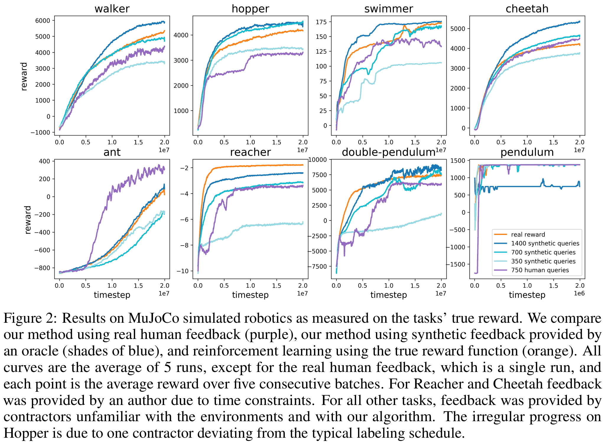
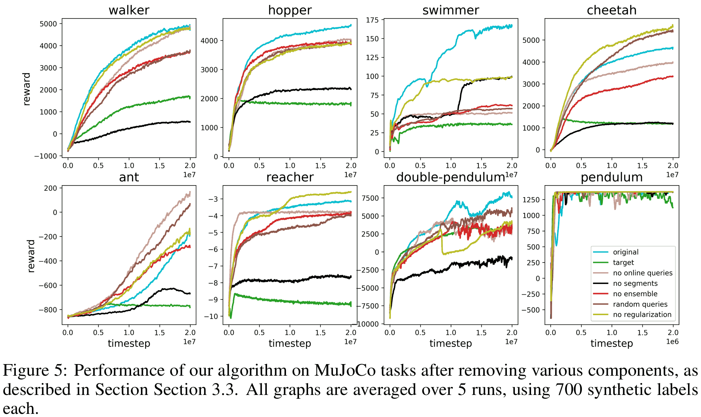

title: NPFL139, Lecture 14
class: title, langtech, cc-by-sa
style: h1 span { font-size: 98% }
# RL from Human Feedback, DPO, RL from Verifiable Rewards, GRPO

## Milan Straka

### May 19, 2026

---
section: RL from Human Feedback
class: section
# Reinforcement Learning from Human Feedback

---
# Reinforcement Learning from Human Feedback

Let us assume our goal is to train a robot to cook eggs.

~~~
For such complex tasks, there might not be suitable reward functions available,
and implementing it manually might be difficult or infeasible.

~~~
If we have demonstrations for the seeked behavior, we might use inverse
reinforcement learning or imitation learning, but some behaviors might be
difficult to demonstrate (like controlling a robot with many degrees of
freedom).

---
# Reinforcement Learning from Human Feedback

A possible approach in such a case is to use **reinforcement learning with human
feedback**, proposed in a 2017 paper.

~~~
Because human feedback is costly, using as little as feedback is desirable.
Therefore, the authors propose to use the feedback to train a reward function,
which can then be used by classical RL algorithms.

~~~
A practical approach is for the human raters to
_compare two video clips of agent's behavior_.
~~~
- Comparing two videos was found out to be considerably easier than providing
  absolute numerical score.

~~~
- Rating videos is nearly as fast as comparing individual states, but
  significantly more helpful.

---
# General Setting

We consider a partially observable MDP, where in time $t$ agent obtains an
observation $o_t$ and produces an action $a_t$.

~~~
In the traditional RL setting, the environment would also produce the reward
$r_t$; we will instead predict a reward $r̂(o_t, a_t)$.

~~~
A **trajectory segment** is a sequence of observations and actions
$$σ = \big((o_0, a_0), (o_1, a_1), …, (o_{k-1}, a_{k-1})\big).$$

~~~
We write $σ^1 ≻ σ^2$ to indicate that a human rater preferred trajectory $σ^1$
over trajectory $σ^2$.

---
# Reinforcement Learning from Human Feedback

We maintain two models:
~~~
- the policy $π \colon 𝓞 → 𝓐$, and
~~~
- the reward function estimate $r̂ \colon 𝓞 × 𝓐 → ℝ$.

~~~
The models are updated by three asynchronously running processes:
~~~
1. The policy $π$ interacts with the environment, obtaining a set of
   trajectories $\{τ^1, …, τ^i\}$.

   The parameters of $π$ are updated using a traditional RL algorithm
   utilizing the estimated reward $r̂$.

~~~
2. A pair of segments $(σ^1, σ^2)$ from trajectories $\{τ^1, …, τ^i\}$
   generated in step 1 is selected and sent to human rater for evaluation.

~~~
3. The reward estimate $r̂$ is trained using supervised learning to fit
   the comparisons selected by the annotators so far.

---
# Reinforcement Learning from Human Feedback

## Optimizing the Policy

During policy optimization, we can utilize the usual RL algorithms.
~~~
The main difference is that the rewards are non-stationary; therefore,
policy-gradient methods are preferred.

~~~
During training, we normalize $r̂$ to have zero mean and constant standard
deviation (the absolute values of the rewards are undetermined in our model).

~~~
## Preference Collection

A visualization given to a rater is a video between 1 and 2 seconds long.
The rater indicate which of the segments they prefer, whether the segments
are equally good, or that they were not able to compare the two segments.

~~~
All human judgements are stored in a dataset $𝓓$ of triples $(σ^1, σ^2, →μ)$,
where $σ^1, σ^2$ are the compared segments and $→μ$ is a distribution over ${1, 2}$
indicating which segment was deemed better. The $→μ$ is either a one hot
distribution when a single segment was preferred, or a uniform distribution when
a rater annotated both videos as being comparable.

---
style: .katex-display { margin: .8em 0 }
# Reward Function Fitting

To fit the reward function, the authors propose to follow the Bradley-Terry
model, which is a binary probability model for the outcome of pairwise
comparisons between players

$$P(\underbrace{i ≻ j}_{\kern-.4em“i\textrm{~beats~}j”\kern-.4em}) = \frac{s_i}{s_i + s_j},$$

where $s_i$ is a positive real-valued score assigned to player $i$.

~~~
There are many possible parametrizations, Bradley and Terry used $s_i
= e^{β_i}$, in which case
~~~
$$P(i ≻ j) = \frac{e^{β_i}}{e^{β_i} + e^{β_j}} = \frac{1}{1 + e^{β_j-β_i}} = σ(β_i - β_j).$$

~~~
Note that with a scaling factor 400 and base 10, this is equivalent to the Elo
rating system with Elo ratings $R_i$ and $R_j$:
$$P(i ≻ j) = \frac{1}{1 + 10^{(R_j-R_i)/400}} = σ\big((R_i-R_j)\tfrac{\log 10}{400}\big).$$

---
style: .katex-display { margin: .8em 0 }
# Reward Function Fitting

In our case, we assume that
$$P̂(σ^1 ≻ σ^2)
  = \frac{\exp ∑r̂(o_t^1, a_t^1)}{\exp ∑r̂(o_t^1, a_t^1) + \exp ∑r̂(o_t^2, a_t^2)}
  = \textstyle σ\big(∑r̂(o_t^1, a_t^1) - ∑r̂(o_t^2, a_t^2)\big).$$

~~~
To fit this model, we minimize the cross-entropy between the observed
distribution of human rating $→μ$ and these predictions:
$$𝓛 = -𝔼_{(σ^1, σ^2, →μ) ∼ 𝓓} \big[μ_1 \log P̂(σ^1 ≻ σ^2) + μ_2 \log P̂(σ^2 ≻ σ^1)\big].$$

~~~
The authors mention several tricks:
~~~
- A whole ensemble of predictors are trained, each using randomly sampled $|𝓓|$
  examples (with replacement) from $𝓓$. The overall $r̂$ is then defined by first
  independently normalizing each of the predictors and then averaging the
  results.
~~~
- A fraction $1/e$ of the data is used as development data, and strength of
  $L^2$-regularization is set so that the development loss is between 1.1 and
  1.5 of the training loss.
~~~
- In the definition of $P̂$, we assume there is a 10% chance of uniform random
  outcome.

---
# Reward Function Fitting

To select the queries for the raters, we
~~~
- sample a large amount of pairs of trajectory segments of length $k$,
~~~
- perform prediction on each pair using all the predictors in our ensemble,
~~~
- choose the pairs with the highest variance in the predictions, which
  approximates the largest uncertainty.

---
# Experiments

In the first set of experiments, the authors attempted to solve existing RL benchmarks
(Atari, MuJoCo) without observing the true rewards, using human feedback
instead.

~~~
For comparison, synthetic feedback (instead of human feedback) was also
considered in these tasks, where $P̂(σ^1 ≻ σ^2)$ is defined by using the real
reward of the trajectory segments.

~~~
For MuJoCo, 700 human ratings were used; for Atari, 5.5k queries were sent to
human raters.
~~~
Overall, the ratings took between 30 minutes and 5 hours for every experiment.

---
# Experiments: MuJoCo

---
# Experiments: Atari

---
# Experiments: Novel Behavior

The authors also demonstrated the effectiveness of human feedback in tasks
without available reward functions:

<iframe src="https://drive.google.com/file/d/0BwcFziBYuA8RVGItSjR2Wm5oWEE/preview?resourcekey=0-apjHEeikNO129je7BkGh5A" width="300" height="300" allow="autoplay" style="display: block; margin: auto; float: right"></iframe>

<iframe src="https://drive.google.com/file/d/0BwcFziBYuA8RdHdrY1p3OHEwTVU/preview?resourcekey=0-mr-Z4KuKyVHyKXbaWwGC0g" width="300" height="300" allow="autoplay" style="display: block; margin: auto; float: right"></iframe>

~~~
- the Hopper robot was trained to perform a backflip using 900 queries in less
  than an hour;

~~~
- the Half-Cheetah was trained to move while standing on just one leg via 800
  queries;

~~~
- in Enduro, the agent was trained to keep the same speed as other cars using
  1 300 queries.

---
# Ablations: MuJoCo

- random queries: queries picked uniformly at random instead of according to
  variance of predictions;

- no ensemble: a single predictor is trained; random queries are implied;

- no online queries: all queries generated at the beginning of the training;

- no regularization: w/o validation $L^2$ condition;

- no segments: rate only images, not videos;

- target: instead of fitting $r̂$ using comparison, we fit given real $r$ using MSE.

---
# Ablations: Atari

---
# Instructions: MuJoCo

- Look at the clips and select the one in which better things happen. Only
  decide on events you actually witness in the clip.

- Here’s a guide on what constitutes good and bad behavior in each specific
  domain:
  - **Hopper**: the “center” of the robot is the joint closest to the pointy end.
    The first priority is for the center of the robot to move to the right
    (moving to the left is worse than not moving at all). If the two robots are
    roughly tied on this metric, then the tiebreaker is how high the center is.

  - **Cheetah**: the robot should move to the right as fast as possible.

  - **Pendulum**: the pendulum should be pointing approximately up. There will be
    a lot of ties where the pendulum has fallen and a lot of “can’t tells” where
    it is off the side of the screen. If you can see one pendulum and it hasn’t
    fallen down, that’s better than being unable to see the other pendulum.

- If both clips look about the same to you, then click “tie”. If you don’t
  understand what’s going on in the clip or find it hard to evaluate, then click
  “can’t tell”.

---
# Instructions: Atari

- Before providing feedback to the AI, play the game yourself for a five minutes
  to get a sense of how it works. It’s often hard to tell what the game is about
  just by looking at short clips, especially if you’ve never played it before.

- Look at the clips and select the one in which better things happen. For
  example, if the left clip shows the AI shooting an enemy ship while the right
  clip shows it being shot by an enemy ship, then better things happen in the
  left clip and thus the left clip is better. Only decide on actions you
  actually witness in the clip.

- Here’s a guide on what constitutes good and bad play in each specific game:
  - **Breakout**: hit the ball with the paddle, break the colored blocks, and
    don’t let the ball fall off the bottom of the screen

  - **Pong**: knock the ball past the opponent’s orange paddle on the left
    (good), and don’t let it go past your green paddle on the right (bad)

- Don’t worry about how the agent got into the situation it is in (for instance,
  it doesn’t matter if one agent has more lives, or is now on a more advanced
  level); just focus on what happens in the clip itself.

---
# Learning to Summarize from Human Feedback

RLHF was used to improve summarization in a 2020 paper.

~~~
The Reddit TL;DR dataset and CNN/Daily Mail dataset were utilized.
The Reddit TL;DR contains 3M posts from reddit.com with summaries written by
original posters; the authors filtered the data (including requiring the
summaries to be between 24 and 48 tokens) and kept 123 169 posts with ~5%
kept as a validation set.

~~~
The following models were considered:

- **Pretrained models**: Pretrained LLMs, with several high-quality examples in
  the prompt.

~~~
- **Supervised baselines**: Finetuned variants of the above models trying to
  predict the summaries from the filtered TL;DR dataset.

~~~
- **Reward models**: Starting from the supervised baselines, RLHF was applied.
  A new output linear layer producing a single scalar was added to the model
  and the model was trained to predict rating $r_{→θ}(x, y_i)$ on the last
  token that corresponded the most to the observed ratings according to the Bradley-Terry model:

  $$𝓛 = -𝔼_{(x, y_0, y_1, i) ∼ 𝓓} \big[\log(σ(r_{→θ}(x, y_i) - r_{→θ}(x, y_{1-i})))\big].$$

---
# Learning to Summarize from Human Feedback

---
# Learning to Summarize from Human Feedback

The human feedback policies are then trained using the reward model.

Generating the entire summary is considered a sequence of actions, each
being a generation of a single BPE token, and the PPO algorithm is used
with the following reward:

$$R(x, y) ≝ r_{→θ}(x, y) - β \log \big[π^\textrm{RL}_{→φ}(y|x) / π^\textrm{SFT}(y|x)\big],$$

~~~
where the per-token KL term serves two purposed:
~~~
- it acts as an entropy bonus to avoid collapsing to a single node;

~~~
- it ensures the policy does not learn to produce outputs completely
  different from the initial model trained with supervised finetuning.

---
# Learning to Summarize from Human Feedback

In total, 64 832 ratings were collected, and they were publicly released.

---
# Learning to Summarize from Human Feedback

---
# Learning to Summarize from Human Feedback

~~~

---
# Training LMs to Follow Instructions with Human Feedback

In 2022, InstructGPT (ChatGPT predecessor) was trained to follow instructions
using human feedback.

~~~

---
# Training LMs to Follow Instructions with Human Feedback

The same Bradley-Terry model is used to train the reward function.

~~~
To speed up comparison collection, the authors presented the labelers between
$K=4$ and $K=9$ responses to rank, producing $\binom{K}{2}$ comparisons for
every prompt.

~~~
However, the comparisons in a single prompt are very correlated, so sampling
them randomly during an epoch caused the model to overfit. Instead, all
$\binom{K}{2}$ comparisons were used in a single batch, which is also more
efficient (only $K$ passes of the reward model, compared to
$\binom{K}{2}$ passes).

~~~
The loss function for the reward model is analogous to before:

$$𝓛 = -\frac{1}{\binom{K}{2}}𝔼_{(x, y_w, y_l) ∼ 𝓓} \big[\log(σ(r_{→θ}(x, y_w) - r_{→θ}(x, y_l)))\big].$$

---
# Training LMs to Follow Instructions with Human Feedback

The SFT models are finetuned using the trained reward model again using the PPO
algorithm, maximizing the following objective:

$$𝔼_{(x, y) ∼ 𝓓_{π_{→φ}^\textrm{RL}}} \big[ r_{→θ}(x, y) - β \log \big(π^\textrm{RL}_{→φ}(y|x) / π^\textrm{SFT}(y|x)\big) \big].$$

~~~
The authors also proposed a variant called PPO-ptx., which also includes an
additional supervised term in the objective:

$$𝔼_{(x, y) ∼ 𝓓_{π_{→φ}^\textrm{RL}}} \big[ r_{→θ}(x, y) - β \log \big(π^\textrm{RL}_{→φ}(y|x) / π^\textrm{SFT}(y|x)\big) \big] + γ 𝔼_{x ∼ 𝓓_\textrm{pretrain}}\big[\log(π_{→φ}^\textrm{RL}(x))\big].$$

---
# Training LMs to Follow Instructions with Human Feedback

---
# Training LMs to Follow Instructions with Human Feedback

---
# Training LMs to Follow Instructions with Human Feedback

---
# Training LMs to Follow Instructions with Human Feedback

---
# Training LMs to Follow Instructions with Human Feedback

---
section: DPO
class: section
# Direct Preference Optimization

---
# Direct Preference Optimization

---
style: .katex-display { margin: .8em 0 }
# Direct Preference Optimization

Recall that in RLHF, the Bradley-Terry model postulates that the human
preferences of answers $y_1$ and $y_2$ to a question $x$ can be written as

$$P^*(y_1 ≻ y_2 \mid x)
  = \frac{\exp r^*(x, y_1)}{\exp r^*(x, y_1) + \exp r^*(x, y_2)}
  = σ\big(r^*(x, y_1) - r^*(x, y_2)\big)$$

for some latent reward model $r^*(x, y)$ that we do not have access to.

~~~
Assuming a static dataset of comparisons $𝓓 = \big(x^{(i)}, y_1^{(i)}, y_2^{(i)}\big)_{i=1}^N$
for $y_1^{(i)}$ preferred over $y_2^{(i)}$, we can learn a parametrized reward
model $r_{→θ}(x, y)$ by minimizing the loss
$$𝓛 = -𝔼_{\{x, y_1, y_2\} ∼ 𝓓} \big[\log σ(r_{→θ}(x, y_1) - r_{→θ}(x, y_2)\big].$$

~~~
Then, we use RL to finetune our model $π_{→φ}(y \mid x)$ from our base model $π_\textrm{ref}(y \mid x)$ to maximize
$$𝓛_\textrm{RL}(π_{→θ}; r_{→θ}) ≝ 𝔼_{x ∼ 𝓓, y ∼ π_{→φ}(y \mid x)}\big[r_{→θ}(x, y)\big] - β D_\textrm{KL}\big(π_{→φ}(y \mid x) \| π_\textrm{ref}(y \mid x)\big).$$

---
style: .katex-display { margin: .5em 0 }
# Direct Preference Optimization

$$𝓛_\textrm{RL}(π; r) ≝ 𝔼_{x ∼ 𝓓, y ∼ π(y \mid x)}\big[r(x, y)\big] - β D_\textrm{KL}\big(π(y \mid x) \| π_\textrm{ref}(y \mid x)\big)$$

~~~
We start by deriving the optimal solution to the maximization objective $\max_π 𝓛_\textrm{RL}(π; r)$.

~~~
$\displaystyle \kern5em\mathllap{\max_{π} 𝓛_\textrm{RL}}
  = \max_π 𝔼_{x ∼ 𝓓, y ∼ π(y \mid x)}\big[r(x, y)\big] - β D_\textrm{KL}\big(π(y \mid x) \| π_\textrm{ref}(y \mid x)\big)$

~~~
$\displaystyle \kern5em{} = \max_π 𝔼_{x ∼ 𝓓, y ∼ π(y \mid x)}\Big[r(x, y) - β \log\tfrac{π(y \mid x)}{π_\textrm{ref}(y \mid x)}\Big]$

~~~
$\displaystyle \kern5em{} = \min_π 𝔼_{x ∼ 𝓓, y ∼ π(y \mid x)}\Big[\log\tfrac{π(y \mid x)}{π_\textrm{ref}(y \mid x)} - \tfrac{1}{β}r(x, y)\Big]$

~~~
$\displaystyle \kern5em{} = \min_π 𝔼_{x ∼ 𝓓, y ∼ π(y \mid x)}\Big[\log\tfrac{π(y \mid x)}{π_\textrm{ref}(y \mid x) \exp(\tfrac{1}{β}r(x, y))}\Big].$

~~~
Normalizing $π_\textrm{ref}(y \mid x) \exp(\tfrac{1}{β}r(x, y))$ into a distribution by introducing the partition function

$$Z(x) ≝ ∑\nolimits_y π_\textrm{ref}(y \mid x) \exp(\tfrac{1}{β}r(x, y)),$$

~~~
we obtain
$\displaystyle \min_π 𝔼_{x ∼ 𝓓, y ∼ π(y \mid x)}\Big[\log\tfrac{π(y \mid x)}{\tfrac{1}{Z(x)}π_\textrm{ref}(y \mid x) \exp(\tfrac{1}{β}r(x, y))} - \log Z(x)\Big].$

---
# Direct Preference Optimization

We now define
$$π^*(y \mid x) ≝ \frac{1}{Z(x)}π_\textrm{ref}(y \mid x) \exp\big(\tfrac{1}{β}r(x, y)\big)$$

~~~
and reorganize the objective as
$$\begin{gathered}
\displaystyle \min_π 𝔼_{x ∼ 𝓓, y ∼ π(y \mid x)}\Big[\log\tfrac{π(y \mid x)}{π^*(y \mid x)} - \log Z(x)\Big] \\
  = \min_π 𝔼_{x ∼ 𝓓}\Big[D_\textrm{KL}\big(π(y \mid x) \| π^*(y \mid x)\big) - \log Z(x)\Big].
\end{gathered}$$

~~~
The optimum to this objective is exactly $π^*(y \mid x)$.

---
# Direct Preference Optimization

Starting with
$$π^*(y \mid x) ≝ \frac{1}{Z(x)}π_\textrm{ref}(y \mid x) \exp\big(\tfrac{1}{β}r(x, y)\big),$$

~~~
we now express $r(x, y)$ in terms of $π^*(y \mid x)$ and $π_\textrm{ref}(y \mid x)$:

~~~
$$\log π^*(y \mid x) = -\log Z(x) + \log π_\textrm{ref}(y \mid x) + \tfrac{1}{β}r(x, y),$$

~~~
$$r(x, y) = β \log\frac{π^*(y \mid x)}{π_\textrm{ref}(y \mid x)} + β \log Z(x).$$

~~~
Therefore, as stated in the paper, _your language model is secretly a reward model_; but the
partition function $Z(x)$ is still not tractable to compute.

---
style: .katex-display { margin: .6em 0 }
# Direct Preference Optimization

Returning back to the Bradley-Terry model $P^*(y_1 ≻ y_2 \mid x) = σ\big(r^*(x, y_1) - r^*(x, y_2)\big)$,
we however see that it only depends on the difference of rewards, so the
partition function $Z(x)$ cancels out:

~~~
$$P^*(y_1 ≻ y_2 \mid x) = σ\bigg(β \log\frac{π^*(y_1 \mid x)}{π_\textrm{ref}(y_1 \mid x)} - β \log\frac{π^*(y_2 \mid x)}{π_\textrm{ref}(y_2 \mid x)}\bigg).$$

~~~
Therefore, we can directly optimize the policy $π_{→φ}(y \mid x)$ without ever
learning the reward model $r_{→θ}(x, y)$, by minimizing the loss
$$\color{darkblue}𝓛_\textrm{DPO}(π_{→φ}) = -𝔼_{\{x, y_1, y_2\} ∼ 𝓓} \bigg[\log σ\bigg(
   β \log\frac{π_{→φ}(y_1 \mid x)}{π_\textrm{ref}(y_1 \mid x)}
 - β \log\frac{π_{→φ}(y_2 \mid x)}{π_\textrm{ref}(y_2 \mid x)}\bigg)\bigg].$$

~~~
To see what the DPO update does, consider $∇_{→φ} 𝓛_\textrm{DPO}(π_{→φ})$ for $r_{→φ}(x, y) = β \log\frac{π_{→φ}(y \mid x)}{π_\textrm{ref}(y \mid x)}$:

$$-β 𝔼_{\{x, y_1, y_2\} ∼ 𝓓} \bigg[
  \underbrace{σ\big(r_{→φ}(x, y_2) - r_{→φ}(x, y_1)\big)}_\textrm{higher when reward est. is wrong}
  \Big(\underbrace{∇_{→φ} \log π_{→φ}(y_1 \mid x)}_{\textrm{incr. likelihood of }y_1}
      -\underbrace{∇_{→φ} \log π_{→φ}(y_2 \mid x)}_{\textrm{decr. likelihood of }y_2} \Big)\bigg].$$

---
# Direct Preference Optimization

---
# Direct Preference Optimization

---
# Direct Preference Optimization with Diffusion Models

---
# Direct Preference Optimization with Diffusion Models

---
section: RLHF Algorithms Benchmark
class: section
# Benchmarking RLHF Algorithms

---
# Benchmarking RLHF Algorithms

Online DPO (using a reward model to rank several samples and then applying DPO
on the best and worst samples) is benchmarked; surprisingly, PPO does not
perform well.

---
section: GRPO
class: section
# Group Relative Policy Optimization

---
# Group Relative Policy Optimization

In PPO, while the reward is computed only for the last token of the prediction,
the KL penalty is computed for every token.

~~~
Therefore, to compute the advantages, a critic estimating the value function for
every token is employed.

~~~
Recall that PPO maximizes the following objective:
$$\begin{aligned}
J_\textrm{PPO}(→θ) = 𝔼_{q ∼ P(Q), o ∼ π_{→θ_\textrm{old}}(O|q)}\bigg[
  \frac{1}{|o|}∑_{t=1}^{|o|} \min\Big(&
    \tfrac{π_{→θ}(o_t|q, o_{<t})}{π_{→θ_\textrm{old}}(o_t|q, o_{<t})} A_t,\\
    &\operatorname{clip}\Big(\tfrac{π_{→θ}(o_t|q, o_{<t})}{π_{→θ_\textrm{old}}(o_t|q, o_{<t})}, 1 - ε, 1 + ε\Big) A_t
    \bigg)\bigg].
\end{aligned}$$

---
style: .katex-display { margin: .5em 0 }
# Group Relative Policy Optimization

In GRPO, we avoid the need for a critic by estimating the value function by
averaging rewards across several samples and computing the KL divergence
separately from the reward.

~~~
The objective is then

$$\begin{aligned}
& J_\textrm{GRPO}(→θ) = 𝔼_{q ∼ P(Q), {o_i}_{i=1}^G ∼ π_{→θ_\textrm{old}}(O|q)}\Bigg[
  \frac{1}{G}∑_{i=1}^G \frac{1}{|o_i|} ∑_{t=1}^{|o_i|} \bigg[ \\
& \kern2em \min\bigg(
      \tfrac{π_{→θ}(o_{i,t}|q, o_{i,<t})}{π_{→θ_\textrm{old}}(o_{i,t}|q, o_{i,<t})} Â_{i,t},
      \operatorname{clip}\Big(\tfrac{π_{→θ}(o_{i,t}|q, o_{i,<t})}{π_{→θ_\textrm{old}}(o_{i,t}|q, o_{i,<t})}, 1 - ε, 1 + ε\Big) Â_{i,t} \bigg) \\
& \kern2em - β D_\textrm{KL}\big(π_{→θ} \| π_{→θ_\textrm{old}}\big) \bigg]\Bigg],
\end{aligned}$$

where $Â_{i,t}$ does not depend on time $t$ and is estimated as
$$Â_{i, t} = \frac{r(q, o_i) - \operatorname{mean}(r(q, o_1), …, r(q, o_G))}{\operatorname{std}(r(q, o_1), …, r(q, o_G))}.$$

---
# Group Relative Policy Optimization

---
# Dr. GRPO (GRPO Done Right)

GRPO has been studied a lot recently, with several proposed improvements.

---
# Dr. GRPO (GRPO Done Right)

GRPO implicitly introduces two biases:

~~~
- _response-level length bias_: dividing by $|o_i|$ can be understood as
  dividing the reward by the length of the response, which prefers short
  correct responses and long incorrect responses;
~~~
- _question-level difficulty bias_: dividing by the standard deviation
  of rewards _for a single question_ causes weights of questions with
  lower variance to be higher (note that when normalizing advantages,
  we usually do it across the whole batch).

---
# DAPO (Dynamic Sampling Policy Optimization)

DAPO proposes the following improvements over GRPO:

~~~

- removing the KL penalty (proposed already sooner; possible when using
  verifiable rewards instead of a reward model which avoids reward hacking);
~~~
- token-level loss instead of averaging across the response, as in Dr. GRPO;
~~~
- using larger clipping factor $ε_\textrm{high}$ to allow faster increase
  of correct low-probable responses; the authors use
  $\operatorname{clip}(…, 1 - ε_\textrm{low}, 1 + ε_\textrm{high})$ for
  $ε_\textrm{low} = 0.2$ and $ε_\textrm{high} = 0.28$;
~~~
- _soft overlong punishment_: responses are sampled with a maximum length
  $L_\textrm{max}$ and longer responses get a reward of -1; furthermore,
  the responses of length $L_\textrm{max} - L_\textrm{cache}$ to
  $L_\textrm{max}$ get a linearly increasing penalty from 0 to -1 (20k and 4k
  are used by the authors);
~~~
- _dynamic sampling_: when sampling responses for a question, we ignore such
  questions where all responses get the same accuracy of 0 or 1.

---
section: RL from Verifiable Rewards
class: section
# Reinforcement Learning from Verifiable Rewards

---
# Reinforcement Learning from Verifiable Rewards

---
# Reinforcement Learning from Verifiable Rewards

---
# Reinforcement Learning from Verifiable Rewards

---
# Reinforcement Learning from Verifiable Rewards

